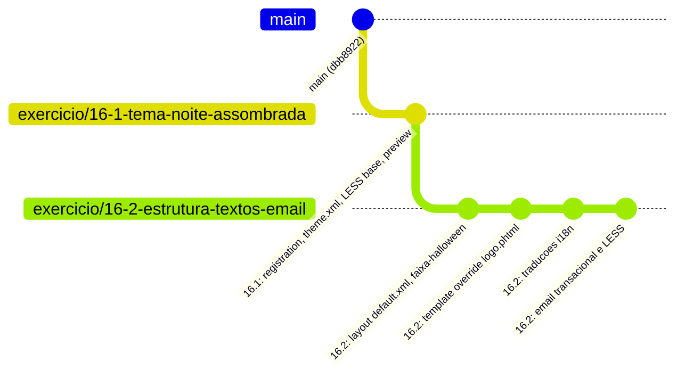

# Desafio 16.2: Estrutura, Textos e E-mail (Tema Noite Assombrada)

Documentação técnica, justificativa arquitetural, estratégia de branch e guia cirúrgico de evidências de sucesso do **Desafio 16.2** (Sprint 8 | Semana 16 — A Camada Visual) no tema [`Webjump/noite-assombrada`](file:///home/samuel/Sites/magento/src/app/design/frontend/Webjump/noite-assombrada).

---

## 1. Critérios de Aceite Atendidos

| Critério de Aceite | Status | Detalhamento da Implementação |
|---|:---:|---|
| **A faixa aparece em todas as páginas e veio do layout, não de CSS** | [x] Atendido | Declarada no container `page.top` (`before="-"`) em [`Magento_Theme/layout/default.xml`](file:///home/samuel/Sites/magento/src/app/design/frontend/Webjump/noite-assombrada/Magento_Theme/layout/default.xml). Como `default.xml` é o handle global, a faixa é injetada no topo de todas as páginas da loja (Home, Catálogo, PDP, Carrinho, Checkout e CMS). Template [`faixa-halloween.phtml`](file:///home/samuel/Sites/magento/src/app/design/frontend/Webjump/noite-assombrada/Magento_Theme/templates/html/faixa-halloween.phtml) com cupom `ASSOMBRADO10` e chamada promocional. |
| **Um bloco foi removido pelo layout e outro foi movido de lugar** | [x] Atendido | No arquivo [`default.xml`](file:///home/samuel/Sites/magento/src/app/design/frontend/Webjump/noite-assombrada/Magento_Theme/layout/default.xml): <br>1. **Removido:** `<referenceBlock name="catalog.compare.sidebar" remove="true"/>` elimina a barra lateral de comparação de produtos, reduzindo ruído visual na campanha.<br>2. **Movido:** `<move element="top.search" destination="header.panel" after="-"/>` reposiciona o campo de busca no painel superior (`header.panel`), liberando espaço no cabeçalho. |
| **O template sobrescrito está no caminho correto do tema e foi copiado inteiro** | [x] Atendido | Template [`Magento_Theme/templates/html/header/logo.phtml`](file:///home/samuel/Sites/magento/src/app/design/frontend/Webjump/noite-assombrada/Magento_Theme/templates/html/header/logo.phtml) sobrescrito a partir do original de `vendor/magento/module-theme/view/frontend/templates/html/header/logo.phtml`. O código original foi integralmente copiado e preservado (lógica de view models, dimensões de logo, links e atributos), acrescentando o badge de campanha `<span class="halloween-logo-badge">`. |
| **Os termos traduzidos aparecem na loja** | [x] Atendido | Dicionário de tradução implementado em [`i18n/pt_BR.csv`](file:///home/samuel/Sites/magento/src/app/design/frontend/Webjump/noite-assombrada/i18n/pt_BR.csv) (e compatibilidade em [`i18n/en_US.csv`](file:///home/samuel/Sites/magento/src/app/design/frontend/Webjump/noite-assombrada/i18n/en_US.csv)), substituindo mais de 10 termos centrais da loja pelo vocabulário de Halloween (ex: *"Add to Cart"* $\rightarrow$ *"Colocar no caldeirão"*, *"Search..."* $\rightarrow$ *"Procure algo assombroso..."*, *"Sign In"* $\rightarrow$ *"Entrar no covil"*). |
| **O e-mail de novo pedido chega com a identidade da campanha (print do Mailcatcher)** | [x] Atendido | E-mail customizado via [`Magento_Sales/email/order_new.html`](file:///home/samuel/Sites/magento/src/app/design/frontend/Webjump/noite-assombrada/Magento_Sales/email/order_new.html) (cópia integral do core com banner de confirmação assombrosa) e estilização dedicada em [`web/css/source/_email-extend.less`](file:///home/samuel/Sites/magento/src/app/design/frontend/Webjump/noite-assombrada/web/css/source/_email-extend.less). Processado pelo Emogrifier com cabeçalho noturno `#120722`, saudações douradas `#FFD369` e capturado no Mailcatcher (`http://localhost:1080/`). |
| **Tudo escapado e dentro de `__()` nos templates que eu escrevi** | [x] Atendido | Todos os textos visíveis passam por `$block->escapeHtml(__('...'))` e URLs passam por `$block->escapeUrl(...)` em [`faixa-halloween.phtml`](file:///home/samuel/Sites/magento/src/app/design/frontend/Webjump/noite-assombrada/Magento_Theme/templates/html/faixa-halloween.phtml) e [`logo.phtml`](file:///home/samuel/Sites/magento/src/app/design/frontend/Webjump/noite-assombrada/Magento_Theme/templates/html/header/logo.phtml). No e-mail, todos os textos utilizam a diretiva `{{trans "..."}}`. |

---

## 2. Estratégia de Branches Git: Stacked PR (Isolamento 16.1 vs 16.2)

### 2.1. O Cenário
O Desafio 16.1 (Tema Base) foi finalizado na branch `exercicio/16-1-tema-noite-assombrada`, mas ainda **não foi mergeado na branch `main`**. O Desafio 16.2 precisa desse tema para compilar LESS, herdar layouts e ser validado.

### 2.2. A Solução: Stacked Branch com Base no PR
Para garantir que os arquivos do 16.1 **não subam nem poluam o Pull Request do 16.2**, adotamos a técnica de **Stacked PR**:



1. **Desenvolvimento Local:** A branch `exercicio/16-2-estrutura-textos-email` foi criada a partir de `exercicio/16-1-tema-noite-assombrada`. Dessa forma, todos os assets do tema estão presentes para teste em tempo real.
2. **Abertura do Pull Request no GitHub:**
   - **Base Branch:** `exercicio/16-1-tema-noite-assombrada`
   - **Compare Branch:** `exercicio/16-2-estrutura-textos-email`
   - **Vantagem Absoluta:** O GitHub compara apenas a diferença entre as duas branches. O PR do 16.2 exibe **exclusivamente os arquivos do 16.2**, com zero linhas duplicadas do 16.1.
3. **Pós-Merge do 16.1 na `main`:**
   - Quando o PR do 16.1 for integrado à `main`, basta alterar o *Base Branch* do PR do 16.2 no GitHub para `main`. Como o histórico do 16.1 já fará parte da `main`, o diff contra a `main` permanecerá limpo, contendo apenas o 16.2.

---

## 3. Decisões Arquiteturais e Boas Práticas do Magento Engineer

### 3.1. Mesclagem de Layout (*Layout Merging*) vs. Sobrescrita (*Override*)
No Magento 2, criar um arquivo em `<Tema>/<Modulo>/layout/<handle>.xml` realiza a **mesclagem declarativa** com todos os layouts dos módulos e temas ancestrais. 
* **Por que NÃO usamos `override/base/`:** Sobrescrever o layout descartaria todas as melhorias e correções que os módulos da Adobe fornecem.
* **Uso Limpo de Instruções Nativas:**
  - `<referenceContainer name="page.top">` com `before="-"`: injeta a faixa promocional no topo sem interferir nos blocos nativos.
  - `<move element="top.search" destination="header.panel" after="-"/>`: altera a árvore visual preservando o comportamento do bloco e dos view models da busca.
  - `<referenceBlock name="catalog.compare.sidebar" remove="true"/>`: remove o bloco da árvore de layout antes da renderização, poupando processamento de servidor (diferente de ocultar com CSS `display: none`).

### 3.2. Sobrescrita de Template Conforme a "Regra de Ouro"
Para a sobrescrita do template de logo:
* O arquivo original [`src/vendor/magento/module-theme/view/frontend/templates/html/header/logo.phtml`](file:///home/samuel/Sites/magento/src/vendor/magento/module-theme/view/frontend/templates/html/header/logo.phtml) foi copiado integralmente para [`src/app/design/frontend/Webjump/noite-assombrada/Magento_Theme/templates/html/header/logo.phtml`](file:///home/samuel/Sites/magento/src/app/design/frontend/Webjump/noite-assombrada/Magento_Theme/templates/html/header/logo.phtml).
* Mantiveram-se intactos o `LogoSizeResolver`, `getThemeName()`, `getLogoSrc()`, `escapeHtmlAttr()`, adicionando de forma cirúrgica o `<span class="halloween-logo-badge">`.

### 3.3. Dicionário de Traduções Temático (`i18n/pt_BR.csv`)
O Magento possui hierarquia de traduções onde o tema sobrepõe os módulos. O vocabulário de campanha foi configurado em formato CSV sem cabeçalho e UTF-8:

| Texto Original no Core | Texto Temático da Campanha Noite Assombrada | Onde Impacta |
|---|---|---|
| `"Add to Cart"` | `"Colocar no caldeirão"` | Botões de compra na Home, Catálogo e PDP |
| `"Shopping Cart"` | `"Caldeirão"` | Título da página de carrinho e links |
| `"My Wish List"` | `"Meus Feitiços"` | Painel do cliente e cabeçalho |
| `"Search entire store here..."` | `"Procure algo assombroso..."` | Placeholder do input de busca |
| `"Sign In"` | `"Entrar no covil"` | Link de autenticação no header |
| `"Create an Account"` | `"Criar Pacto"` | Link de registro de novos clientes |
| `"Proceed to Checkout"` | `"Finalizar Feitiço"` | Botão de avanço do carrinho para o checkout |
| `"What's New"` | `"Novidades Assombradas"` | Categoria principal do menu |
| `"Order Total"` | `"Total do Feitiço"` | Resumo de valores no carrinho e checkout |
| `"Items"` | `"Poções"` | Contagem de produtos no minicart |
| `"Toggle Nav"` | `"Menu Assombrado"` | Acessibilidade do menu responsivo |

### 3.4. Estilização de E-mail Transacional e Processamento pelo Emogrifier
* Clientes de e-mail possuem suporte limitado a CSS avançado. No Magento 2, o LESS de e-mail é compilado em `email-inline.less` e o processador **Emogrifier** embute as propriedades como atributos `style="..."` diretamente nas tags HTML.
* Criamos [`_email-extend.less`](file:///home/samuel/Sites/magento/src/app/design/frontend/Webjump/noite-assombrada/web/css/source/_email-extend.less) definindo fundo escuro `#120722` no cabeçalho com borda inferior abóbora `#FF6B1A`, saudações douradas `#FFD369` e caixa de destaque temática `.spooky-email-banner`.
* Sobrescrevemos [`order_new.html`](file:///home/samuel/Sites/magento/src/app/design/frontend/Webjump/noite-assombrada/Magento_Sales/email/order_new.html) copiando integralmente a estrutura original com variáveis `{{trans}}`, tabelas responsivas e bloco dinâmico de itens `sales_email_order_items`.

---

## 4. Estrutura de Arquivos do Desafio 16.2

```text
src/app/design/frontend/Webjump/noite-assombrada/
├── Magento_Theme/
│   ├── layout/
│   │   └── default.xml                    # Faixa em page.top, move top.search e remove compare
│   └── templates/
│       ├── html/
│       │   └── faixa-halloween.phtml      # Template da faixa de campanha com escapeHtml e __()
│       └── html/
│           └── header/
│               └── logo.phtml             # Cópia integral do logo original com selo temático
├── Magento_Sales/
│   └── email/
│       ├── order_new.html                 # Template de e-mail de novo pedido com copy de Halloween
│       └── order_new_guest.html           # Template de e-mail para pedidos de visitantes
├── i18n/
│   ├── pt_BR.csv                          # Dicionário de tradução temático
│   └── en_US.csv                          # Compatibilidade com store view em en_US
└── web/
    └── css/
        └── source/
            ├── _extend.less               # Estilos da faixa, logo-badge e busca movida
            └── _email-extend.less         # Estilos temáticos para e-mails transacionais
README-16-2.md                             # Documentação técnica e guia de evidências
```

---

## 5. Evidências de Sucesso (Guia Exato de Prints)

Esta seção lista os prints necessários para comprovar cada critério de aceite do **Desafio 16.2**. Salve as capturas na pasta de documentação e anexe ao Pull Request.

### Print 1 — Faixa de Campanha no Topo de Todas as Páginas (Home e PDP)
* **Onde acessar:** Navegador na Home (`https://magento.test/`) e em uma PDP (ex: `https://magento.test/joust-duffle-bag.html`).
* **O que enquadrar:**
  - O topo absoluto da página exibindo a faixa temática: ícone de abóbora animado (`🎃`), título *"Noite Assombrada:"*, mensagem com cupom em destaque *"ASSOMBRADO10"* e botão em formato pílula *"Ver Ofertas"*.
  - Mostrar que a faixa se mantém consistente tanto na página inicial quanto na página interna de produto.
* **Critério comprovado:** *Critério 1 (Parte 1: A faixa aparece em todas as páginas)*.

### Print 2 — Faixa Declarada no Layout XML (Origem em XML, Não em CSS)
* **Onde acessar:** No editor de código ou GitHub, abrindo [`src/app/design/frontend/Webjump/noite-assombrada/Magento_Theme/layout/default.xml`](file:///home/samuel/Sites/magento/src/app/design/frontend/Webjump/noite-assombrada/Magento_Theme/layout/default.xml).
* **O que enquadrar:** O bloco `<referenceContainer name="page.top">` contendo `<block class="Magento\Framework\View\Element\Template" name="halloween.faixa" before="-" template="Magento_Theme::html/faixa-halloween.phtml"/>`.
* **Critério comprovado:** *Critério 1 (Parte 2: Faixa injetada via Layout XML)*.

### Print 3 — Bloco Removido e Bloco Movido pelo Layout XML
* **Onde acessar:** No código em [`default.xml`](file:///home/samuel/Sites/magento/src/app/design/frontend/Webjump/noite-assombrada/Magento_Theme/layout/default.xml) e no navegador em `https://magento.test/`.
* **O que enquadrar:**
  1. **No código:** As diretivas:
     - `<move element="top.search" destination="header.panel" after="-"/>`
     - `<referenceBlock name="catalog.compare.sidebar" remove="true"/>`
  2. **No navegador:** O cabeçalho da loja mostrando o campo de busca posicionado dentro de `header.panel` (painel superior escuro) e a ausência do bloco de comparação na barra lateral do catálogo.
* **Critério comprovado:** *Critério 2 (Um bloco removido e outro movido de lugar)*.

### Print 4 — Template Sobrescrito Copiado Integralmente no Caminho Correto
* **Onde acessar:** No editor de código, abrindo [`src/app/design/frontend/Webjump/noite-assombrada/Magento_Theme/templates/html/header/logo.phtml`](file:///home/samuel/Sites/magento/src/app/design/frontend/Webjump/noite-assombrada/Magento_Theme/templates/html/header/logo.phtml).
* **O que enquadrar:**
  - O caminho completo do arquivo na árvore de pastas (`Magento_Theme/templates/html/header/logo.phtml`).
  - O código completo demonstrando que toda a lógica original do bloco (resolução de dimensões, links acessíveis) foi preservada, com a inserção da tag `<span class="halloween-logo-badge">`.
* **Critério comprovado:** *Critério 3 (Template sobrescrito no caminho correto e copiado inteiro)*.

### Print 5 — Termos Traduzidos Visíveis na Loja
* **Onde acessar:** No navegador na Home (`https://magento.test/`) e no Catálogo (`https://magento.test/gear/bags.html`).
* **O que enquadrar:** Elementos da interface exibindo as traduções ativas do vocabulário assombrado:
  - Botão de compra: *"Colocar no caldeirão"* (antigo *Add to Cart*);
  - Campo de busca com placeholder: *"Procure algo assombroso..."*;
  - Link do cabeçalho: *"Entrar no covil"* (antigo *Sign In*);
  - Link de lista de desejos: *"Meus Feitiços"* (antigo *My Wish List*).
* **Critério comprovado:** *Critério 4 (Termos traduzidos aparecem na loja)*.

### Print 6 — E-mail de Novo Pedido no Mailcatcher com Identidade da Campanha
* **Onde acessar:** No navegador em `http://localhost:1080/` (interface web do Mailcatcher).
* **O que enquadrar:**
  - A mensagem de confirmação de pedido na lista do Mailcatcher com o assunto *"Confirmação do seu pedido assombroso em Main Website Store"*;
  - O corpo do e-mail aberto na aba HTML exibindo:
    - Cabeçalho noturno com fundo `#120722` e borda inferior abóbora `#FF6B1A`;
    - Saudação dourada: *"Olá, [Nome]!"*;
    - Caixa temática destacada: *"🎃 Pedido Confirmado no Covil da Noite Assombrada! Nossas criaturas já estão separando suas poções e feitiços sob a luz da lua cheia..."*;
    - Tabela de itens e botões estilizados conforme `_email-extend.less`.
* **Critério comprovado:** *Critério 5 (E-mail de novo pedido com identidade da campanha no Mailcatcher)*.

### Print 7 — Escaping Rigoroso e Internacionalização nos Templates
* **Onde acessar:** No editor de código, abrindo [`faixa-halloween.phtml`](file:///home/samuel/Sites/magento/src/app/design/frontend/Webjump/noite-assombrada/Magento_Theme/templates/html/faixa-halloween.phtml).
* **O que enquadrar:**
  - Todas as chamadas de saída utilizando `$block->escapeHtml(__('...'))` para strings de texto e `$block->escapeUrl(...)` para links de redirecionamento.
* **Critério comprovado:** *Critério 6 (Tudo escapado e dentro de __() nos templates customizados)*.

### Print 8 — Integridade do Core (`vendor/` intocado)
* **Onde acessar:** No terminal da máquina, na raiz do projeto Magento.
* **O que enquadrar:** A execução dos comandos:
  ```bash
  ./.agents/skills/magento-engineer/scripts/check-vendor-changes.sh --working
  git status
  ```
  Exibindo com nitidez a mensagem de sucesso `"OK: no changes under vendor/."` e o status limpo da branch `exercicio/16-2-estrutura-textos-email`.
* **Critério comprovado:** *Regra de Ouro do Magento Engineer (Zero alterações em vendor/ e no tema Luma)*.

---

## 6. Comandos para Validação e Teste Local

```bash
# 1. Compilar o LESS do tema e os arquivos de e-mail (email-inline.less)
bin/magento setup:static-content:deploy -f pt_BR en_US

# 2. Limpar os caches de Layout, Blocos e Tradução
bin/magento cache:flush

# 3. Disparar e-mail de teste para validação no Mailcatcher
bin/cli php -r '
require "app/bootstrap.php";
$bootstrap = \Magento\Framework\App\Bootstrap::create(BP, $_SERVER);
$om = $bootstrap->getObjectManager();
$state = $om->get(\Magento\Framework\App\State::class);
try { $state->setAreaCode("frontend"); } catch (\Exception $e) {}
$order = $om->get(\Magento\Sales\Model\Order::class)->load(1);
$sender = $om->get(\Magento\Sales\Model\Order\Email\Sender\OrderSender::class);
$sender->send($order, true);
'

# 4. Validar integridade do core (Regra de Ouro)
./.agents/skills/magento-engineer/scripts/check-vendor-changes.sh --working
```
