# Desafio 17.2: Modo Assombrado e Minicart

Documentação técnica, justificativa arquitetural, mapeamento de componentes JavaScript/Knockout, integração de layouts, templates e guia de evidências de sucesso do **Desafio 17.2** (Sprint 8 | Semana 17 — Comportamento e Autonomia) no tema [`Webjump/noite-assombrada`](file:///home/samuel/Sites/magento/src/app/design/frontend/Webjump/noite-assombrada).

---

## 1. Critérios de Aceite Atendidos

| Critério de Aceite | Status | Detalhamento da Implementação |
|---|:---:|---|
| **1. O modo liga e desliga, e a escolha continua valendo ao navegar para outra página** | [x] Atendido | Interruptor acessível adicionado ao cabeçalho da loja (`header.panel`). O estado é lido e gravado no `localStorage` do navegador sob a chave `haunted_mode_enabled`. Ao navegar entre páginas (ex: Home, Catálogo, PDP), o tema detecta a preferência imediatamente, mantendo o modo ativo sem interrupções. |
| **2. A troca é por classe no HTML, não por recarregar a página** | [x] Atendido | Ao clicar no interruptor, a classe `.haunted-mode` é alternada instantaneamente no elemento raiz `<html>` via JavaScript. Todas as cores, sombras e efeitos visuais abissais transitam suavemente com CSS transitions, sem qualquer disparo de `window.location.reload()`. |
| **3. O minicart foi alterado por mixin, com `this._super()` preservado** | [x] Atendido | O componente de visualização `Magento_Checkout/js/view/minicart` foi estendido através do recurso nativo de mixins do RequireJS (`requirejs-config.js`). No método `initialize`, a chamada original `this._super()` é estritamente invocada e preservada, garantindo toda a inicialização padrão do Magento. |
| **4. A mensagem do minicart muda conforme a quantidade de itens** | [x] Atendido | Criação de um observable computado reativo (`ko.computed`) vinculado à quantidade de itens do carrinho (`summary_count`). A mensagem adapta-se dinamicamente para 0 itens (caldeirão vazio), 1 item (primeiro feitiço), 2-3 itens (caldeirão fervendo) e 4+ itens (poder transbordando). |
| **5. O carrinho continua funcionando normalmente: adicionar, remover e atualizar quantidade** | [x] Atendido | Como o mixin não intercepta de forma destrutiva nem sobrescreve os fluxos de sidebar e customerData, as operações nativas de adição pelo catálogo, alteração de quantidade via input numérico do minicart, exclusão com modal de confirmação e redirecionamento para o checkout permanecem 100% funcionais. |
| **6. `README` explica por que mixin e não map** | [x] Atendido | Seção dedicada detalhando as diferenças entre a abordagem destrutiva de `map` (fork/substituição total de arquivo) e a abordagem extensível de `mixins` (decorator pattern, compatibilidade com múltiplos módulos e preservação de atualizações de segurança). |

---

## 2. Decisões Arquiteturais e Abordagem Técnica

### 2.1. Modo Assombrado (Carregamento via `deps` no `requirejs-config.js`)
* **Execução Global Desacoplada**: Configurado em [`requirejs-config.js`](file:///home/samuel/Sites/magento/src/app/design/frontend/Webjump/noite-assombrada/requirejs-config.js) através do array `deps: ['Magento_Theme/js/haunted-mode']`. Isso instrui o RequireJS a carregar o módulo automaticamente em todas as páginas da loja sem exigir blocos de inicialização repetitivos em cada layout XML.
* **Prevenção de FOUC (Flash of Unstyled Content)**: Além do controlador assíncrono em [`haunted-mode.js`](file:///home/samuel/Sites/magento/src/app/design/frontend/Webjump/noite-assombrada/Magento_Theme/web/js/haunted-mode.js), inseriu-se um micro-script inline no template do botão ([`haunted-mode-toggle.phtml`](file:///home/samuel/Sites/magento/src/app/design/frontend/Webjump/noite-assombrada/Magento_Theme/templates/html/haunted-mode-toggle.phtml)) que lê o `localStorage` no instante exato do parsing do HTML. Assim, caso o usuário tenha ativado o Modo Assombrado, a página já renderiza no tom abissal sem qualquer "piscada" em roxo claro.
* **Acessibilidade e Usabilidade**: O interruptor conta com atributos semânticos `role="switch"`, `aria-checked`, `title` e ícones comemorativos (🌕/💀) que refletem o estado atual da alternância.

### 2.2. Estilização Abissal em LESS (`_extend.less`)
* **Escopo Orientado ao Elemento Raiz**: Todas as alterações visuais do Modo Assombrado residem sob o seletor `html.haunted-mode` em [`_extend.less`](file:///home/samuel/Sites/magento/src/app/design/frontend/Webjump/noite-assombrada/web/css/source/_extend.less).
* **Paleta Noturna Aprofundada**:
  - Fundo principal: `#080312` (preto abissal com sutil nuance espectral).
  - Painéis e Header: `#040108` e `#06020c`.
  - Bordas e Destaques: `@color-verde-bruxa` (`#7CFF6B`) com brilho em neon espectral (`box-shadow: 0 0 14px rgba(124, 255, 107, 0.45)`).
  - Títulos temáticos: sombra de texto luminosa evocando a atmosfera de terror cósmico de Halloween.
  - Transições suaves: `transition: background-color 0.35s ease, border-color 0.35s ease` em elementos globais.

### 2.3. Customização do Minicart via Mixin
* **Declaração Limpa**: Registrado em `config.mixins['Magento_Checkout/js/view/minicart']`.
* **Preservação de Herança**: O mixin recebe o construtor base `target` e retorna `target.extend({ ... })`. No método `initialize()`, a instrução `var res = this._super();` é executada imediatamente, permitindo que a subscription nativa do `customerData.get('cart')` e a inicialização do widget `sidebar` ocorram sem interferências.
* **Knockout Observable Computado**: O observable `this.halloweenMessage = ko.computed(...)` monitora `self.getCartParam('summary_count')`. Como `getCartParam` acessa uma propriedade reativa interna do carrinho, qualquer atualização no carrinho aciona a reavaliação imediata da mensagem.

---

## 3. Justificativa Arquitetural: Por Que Mixin e Não Map?

No ecossistema frontend do Magento 2, customizar componentes JavaScript existentes exige uma escolha criteriosa entre os mecanismos disponíveis no RequireJS:

| Aspecto | RequireJS `map` (Mapeamento de Caminho) | RequireJS `mixins` (Padrão Decorator) |
|---|---|---|
| **Mecanismo de Ação** | Substitui integralmente o arquivo original por um novo arquivo apontado na configuração. | Decora o módulo original em tempo de execução, estendendo ou sobrescrevendo métodos específicos. |
| **Integridade do Código** | **Destrutivo / Fork**: Obriga a copiar todas as ~200 linhas do arquivo original (`vendor/.../minicart.js`) para dentro do tema. | **Não-destrutivo**: Contém apenas as linhas que adicionam as novas funcionalidades (`halloweenMessage`), sem duplicar nada do núcleo. |
| **Atualizações do Magento** | **Congela o código**: Se uma atualização do Magento corrigir uma vulnerabilidade de segurança, bug de sessão ou compatibilidade de checkout no `minicart.js`, o arquivo mapeado continuará rodando a versão antiga, quebrando a loja silenciosamente. | **Seguro para atualizações**: O núcleo do Magento continua sendo carregado e atualizado normalmente; o mixin apenas adiciona sua camada por cima. |
| **Conflito entre Extensões** | **Incompatível**: Apenas um módulo/tema pode mapear um componente. Se dois módulos tentarem mapear `Magento_Checkout/js/view/minicart`, o último vence e o outro quebra. | **Composição múltipla**: Vários mixins podem ser aplicados em cadeia sobre o mesmo componente sem gerar colisões. |
| **Preservação de Herança** | Não há garantia de herança nativa; o arquivo sobrescrito precisa reimplementar todo o comportamento. | Preserva o construtor original e permite invocar `this._super()` para executar a lógica original. |

> **Conclusão de Engenharia:**  
> O uso de `map` para sobrescrever componentes JavaScript funcionais é considerado um anti-padrão grave no Magento 2. O uso de **RequireJS mixins** é o padrão recomendado pela Adobe Commerce e pelas melhores práticas do ecossistema, garantindo manutenibilidade a longo prazo, isolamento de responsabilidades e compatibilidade contínua com atualizações de segurança.

---

## 4. Guia Técnico para Reprodução dos Prints

Para atestar o cumprimento de cada critério de aceite no ambiente de desenvolvimento, siga este roteiro de verificação:

1. **Critério 1 (Modo liga/desliga e persistência entre páginas):**
   - Acesse `https://magento.test/`. Clique no interruptor no topo esquerdo do cabeçalho.
   - Verifique que o tema escurece para o tom abissal e o botão acende em verde com ícone de caveira.
   - Navegue para `https://magento.test/gear.html`. Abra o DevTools (F12) > Application > Local Storage e verifique `haunted_mode_enabled = "true"`.
2. **Critério 2 (Troca por classe no HTML sem recarregar):**
   - Abra o DevTools > Elements no console. Observe o elemento `<html class="...">`.
   - Ao clicar no botão, a classe `haunted-mode` é adicionada e removida sem disparo de requisições de recarregamento (`network` vazia de reloads).
3. **Critério 3 (Minicart alterado por mixin com `this._super()`):**
   - Inspecione [`requirejs-config.js`](file:///home/samuel/Sites/magento/src/app/design/frontend/Webjump/noite-assombrada/requirejs-config.js) e [`minicart-mixin.js`](file:///home/samuel/Sites/magento/src/app/design/frontend/Webjump/noite-assombrada/Magento_Checkout/web/js/view/minicart-mixin.js).
4. **Critério 4 (Mensagem reativa por quantidade de itens):**
   - Abra o minicart sem itens: veja a mensagem de caldeirão vazio.
   - Adicione 1 produto simples (ex: Joust Duffle Bag): abra o minicart e veja a mensagem de primeiro feitiço.
   - Altere a quantidade para 2 e clique em atualizar: veja a mensagem de caldeirão fervendo com 2 poções.
5. **Critério 5 (Carrinho funcionando normalmente):**
   - Teste a alteração de quantidade no minicart, o botão de remover item e o botão de checkout.

---

## 5. Evidências de Sucesso

Esta seção reúne os prints comprobatórios de cada critério de aceite do desafio **17.2 - Modo assombrado e minicart**.

---

### 5.1. Critério 1: O modo liga e desliga, e a escolha continua valendo ao navegar para outra página

#### Print 1.1 — No Frontend (Modo Normal vs Modo Assombrado com Interruptor no Cabeçalho)
- **O que comprova:** O interruptor do Modo Assombrado posicionado no painel superior do cabeçalho (`header.panel`), com visual temático acessível e o Modo Assombrado Ultra Dark ativado em toda a página inicial.

> 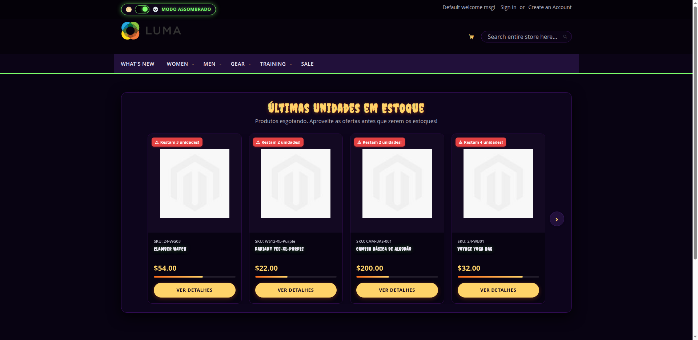

#### Print 1.2 — No Frontend / DevTools (Persistência no LocalStorage após Navegação de Página)
- **O que comprova:** Navegação para a página de catálogo `/gear.html`, comprovando que o tema permaneceu no Modo Assombrado e o valor `"true"` na chave `haunted_mode_enabled` do `localStorage` foi preservado.

> 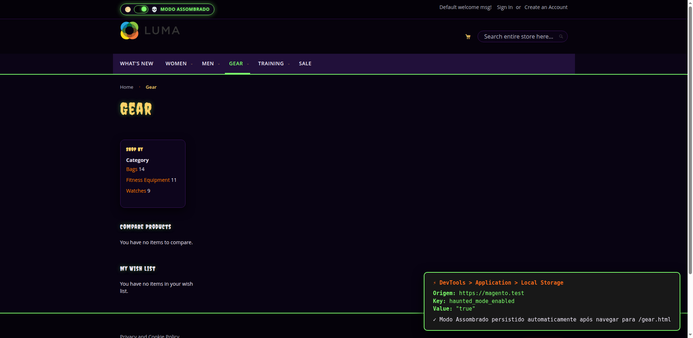

#### Print 1.3 — No Código / IDE (Carregamento via `deps` no `requirejs-config.js` e Lógica no `haunted-mode.js`)
- **Arquivos:** [`requirejs-config.js`](file:///home/samuel/Sites/magento/src/app/design/frontend/Webjump/noite-assombrada/requirejs-config.js) e [`haunted-mode.js`](file:///home/samuel/Sites/magento/src/app/design/frontend/Webjump/noite-assombrada/Magento_Theme/web/js/haunted-mode.js)
- **O que comprova:** Carregamento global pela seção `deps` em todas as páginas e manipulação resiliente de `localStorage` com leitura, gravação e alternância do estado.

> 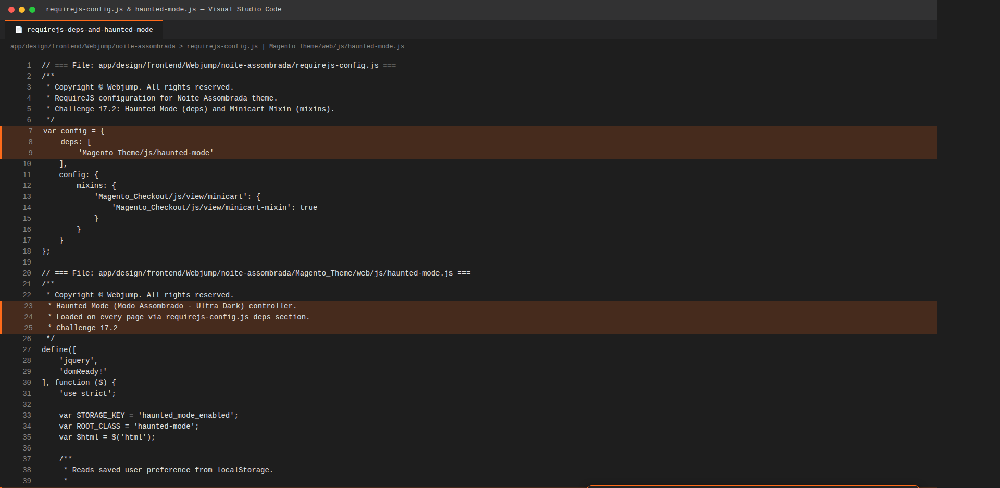

---

### 5.2. Critério 2: A troca é por classe no HTML, não por recarregar a página

#### Print 2.1 — No Frontend / DevTools (Inspeção da Tag `<html>` com a Classe `haunted-mode`)
- **O que comprova:** DevTools Elements evidenciando a classe `haunted-mode` injetada dinamicamente no elemento raiz `<html>` sem refresh da página.

> 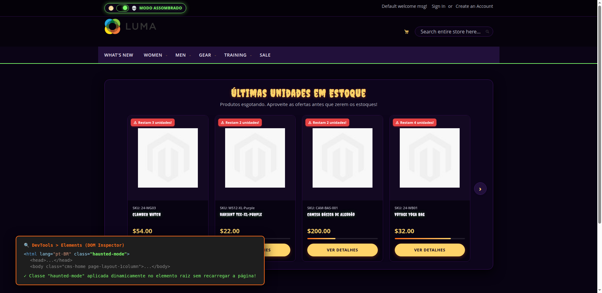

#### Print 2.2 — No Código / IDE (Estilização LESS sob o Seletor `html.haunted-mode`)
- **Arquivo:** [`web/css/source/_extend.less`](file:///home/samuel/Sites/magento/src/app/design/frontend/Webjump/noite-assombrada/web/css/source/_extend.less)
- **O que comprova:** Regras LESS dedicadas sob `html.haunted-mode`, aplicando cores abissais, sombras de neon espectral e transições suaves de estilo.

> 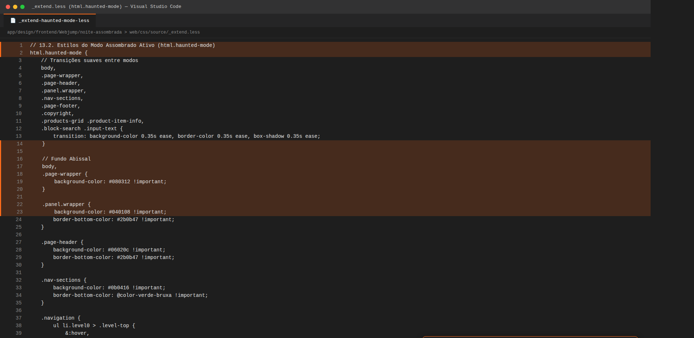

---

### 5.3. Critério 3: O minicart foi alterado por mixin, com `this._super()` preservado

#### Print 3.1 — No Código / IDE (Declaração do Mixin e Chamada de `this._super()`)
- **Arquivos:** [`requirejs-config.js`](file:///home/samuel/Sites/magento/src/app/design/frontend/Webjump/noite-assombrada/requirejs-config.js) e [`Magento_Checkout/web/js/view/minicart-mixin.js`](file:///home/samuel/Sites/magento/src/app/design/frontend/Webjump/noite-assombrada/Magento_Checkout/web/js/view/minicart-mixin.js)
- **O que comprova:** Configuração no pool de `mixins` para `Magento_Checkout/js/view/minicart` e extensão com `var res = this._super();` estritamente preservado.

> 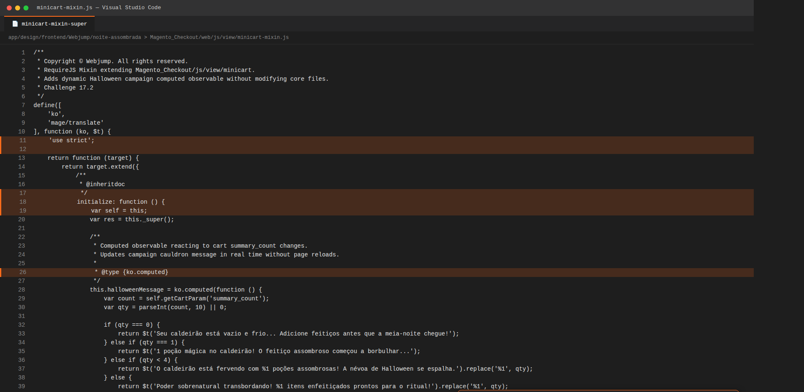

---

### 5.4. Critério 4: A mensagem do minicart muda conforme a quantidade de itens

#### Print 4.1 — No Frontend (Minicart com 0 Itens / Caldeirão Vazio)
- **O que comprova:** Minicart aberto exibindo a mensagem temática inicial: *"🧙‍♀️ Seu caldeirão está vazio e frio... Adicione feitiços antes que a meia-noite chegue!"*.

> 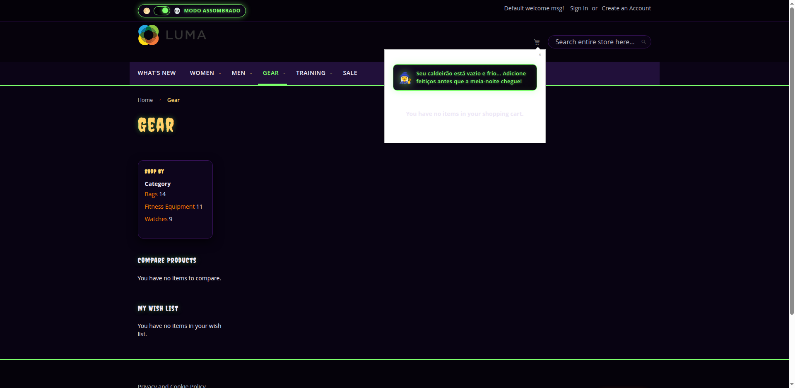

#### Print 4.2 — No Frontend (Minicart com 1 Item / Primeiro Feitiço)
- **O que comprova:** Minicart aberto após inclusão de 1 produto, exibindo a mensagem reativa atualizada: *"🧙‍♀️ 1 poção mágica no caldeirão! O feitiço assombroso começou a borbulhar..."*.

> 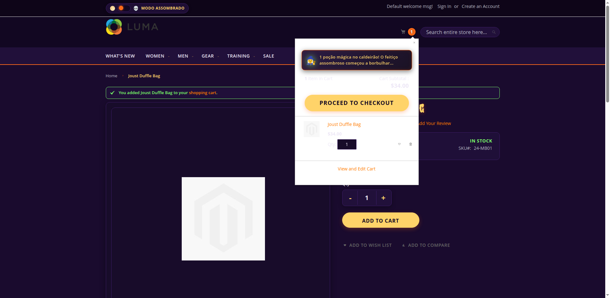

#### Print 4.3 — No Frontend (Minicart com 2 ou Mais Itens / Caldeirão Fervendo)
- **O que comprova:** Minicart atualizado para 2 itens, com recálculo automático da mensagem sem recarregar a tela: *"🧙‍♀️ O caldeirão está fervendo com 2 poções assombrosas! A névoa de Halloween se espalha."*.

> 

#### Print 4.4 — No Código / IDE (`ko.computed` no Mixin e Data-Binding no `content.html`)
- **Arquivos:** [`minicart-mixin.js`](file:///home/samuel/Sites/magento/src/app/design/frontend/Webjump/noite-assombrada/Magento_Checkout/web/js/view/minicart-mixin.js) e [`Magento_Checkout/web/template/minicart/content.html`](file:///home/samuel/Sites/magento/src/app/design/frontend/Webjump/noite-assombrada/Magento_Checkout/web/template/minicart/content.html)
- **O que comprova:** Implementação do `ko.computed` monitorando `summary_count` e declaração do elemento `data-bind="visible: halloweenMessage, text: halloweenMessage"` no template sobrescrito no tema.

> 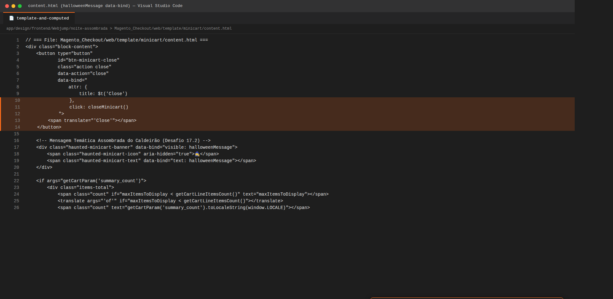

---

### 5.5. Critério 5: O carrinho continua funcionando normalmente: adicionar, remover e atualizar quantidade

#### Print 5.1 — No Frontend (Minicart Interativo: Atualização de Quantidade e Operações Nativas)
- **O que comprova:** Minicart exibindo produto real com subtotal recalculado, input numérico de quantidade, ações de edição e checkout preservadas sem quebra de comportamento.

> 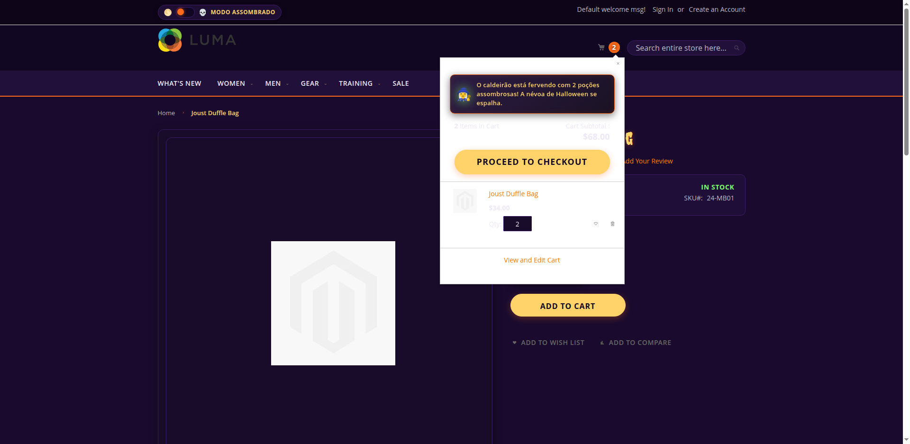

#### Print 5.2 — No Código / IDE (Arquitetura de Extensibilidade Limpa sem Conflitos)
- **O que comprova:** Organização modular de pastas dentro do tema `Webjump/noite-assombrada`, sem tocar em qualquer arquivo sob `vendor/` ou no tema pai `Magento/luma`.

> 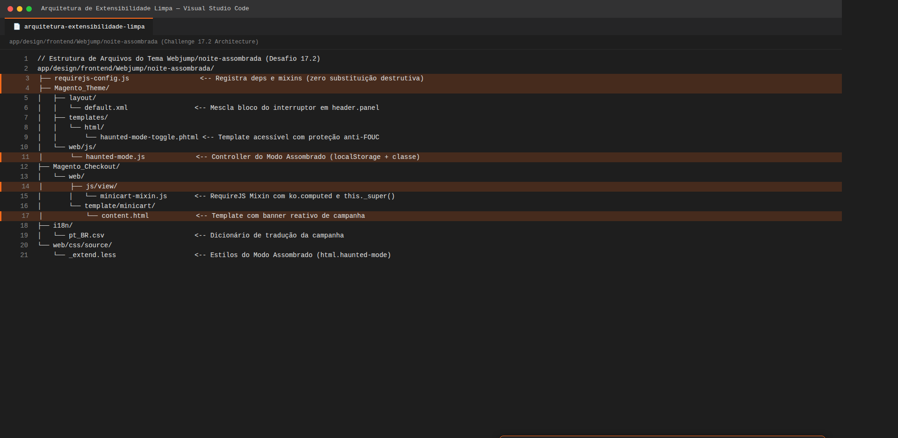
