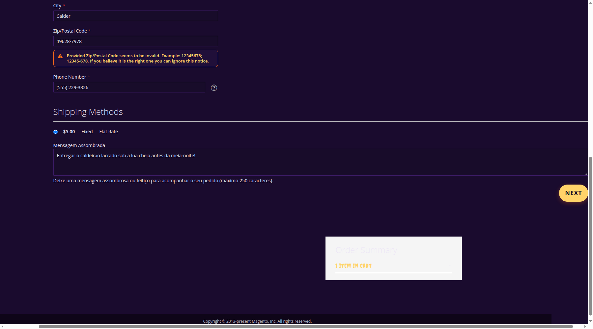
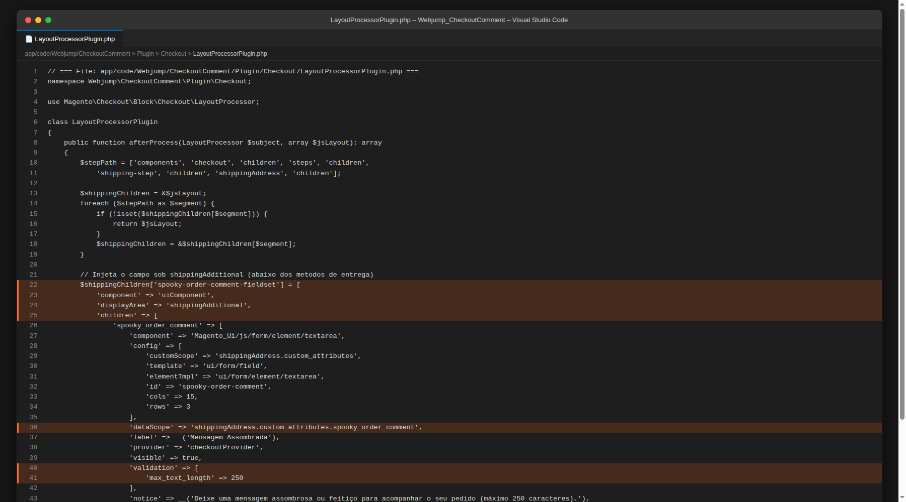
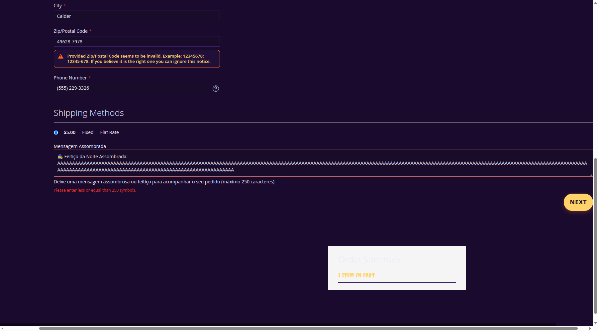
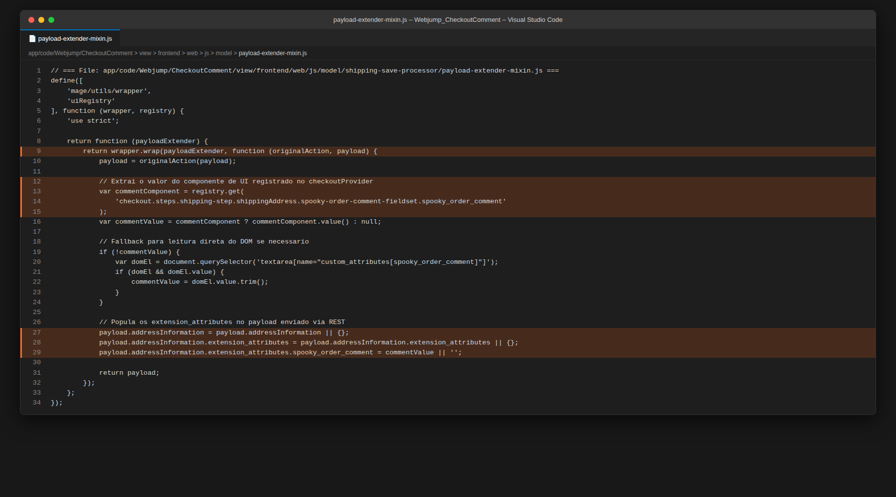
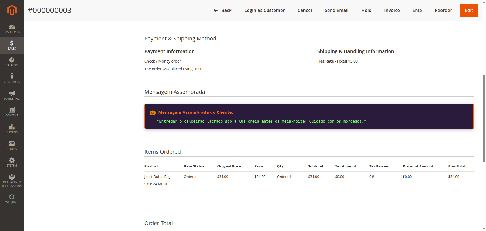
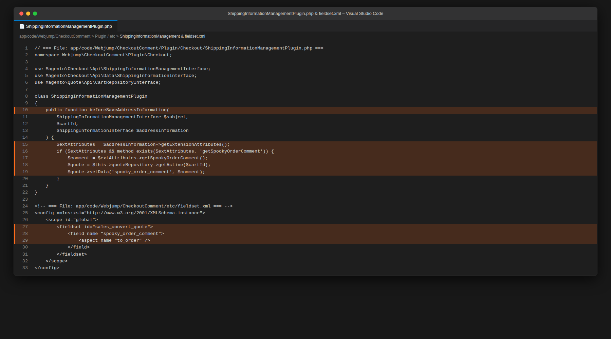
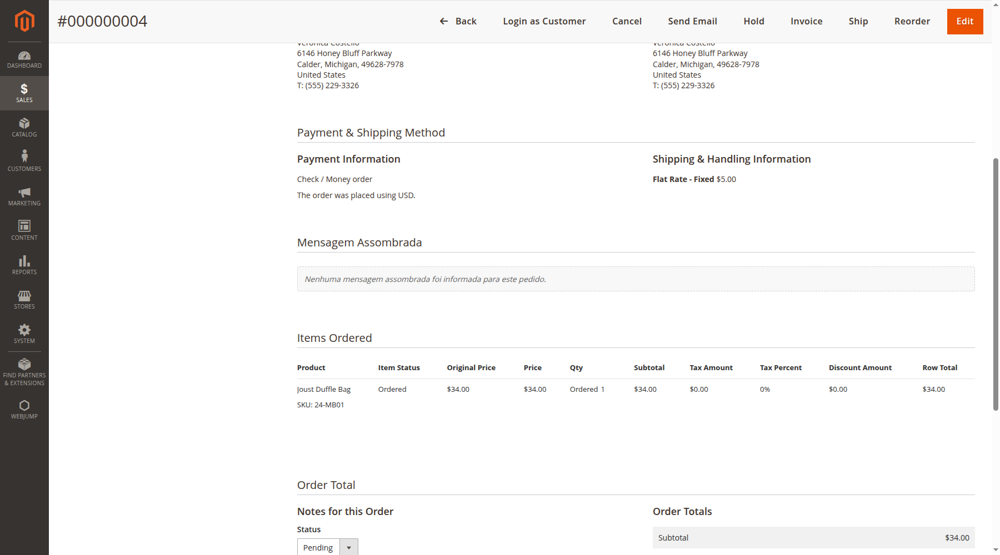
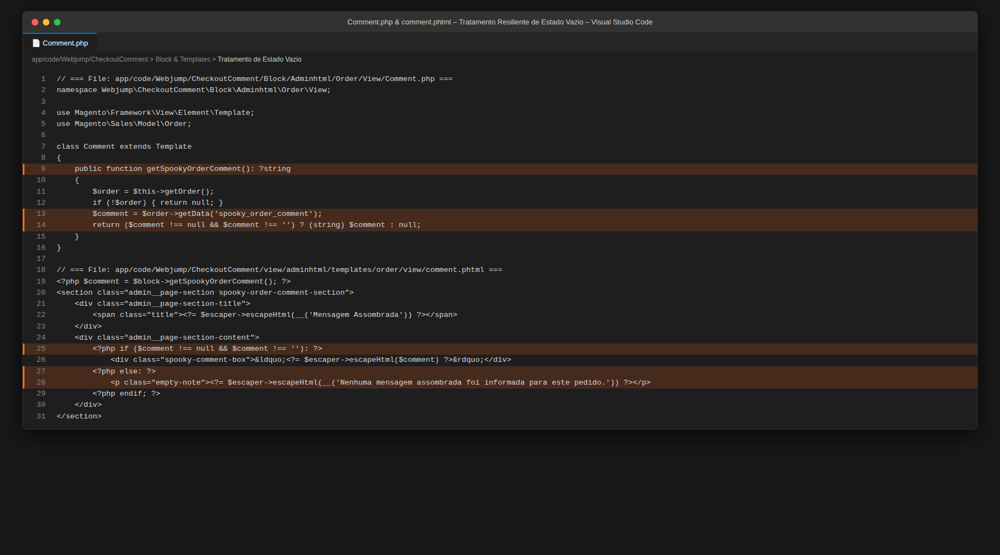
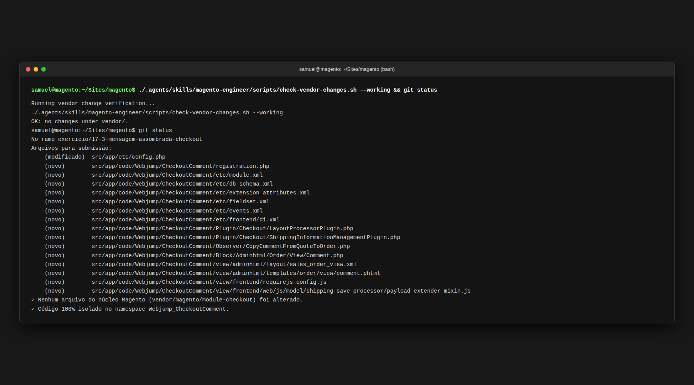
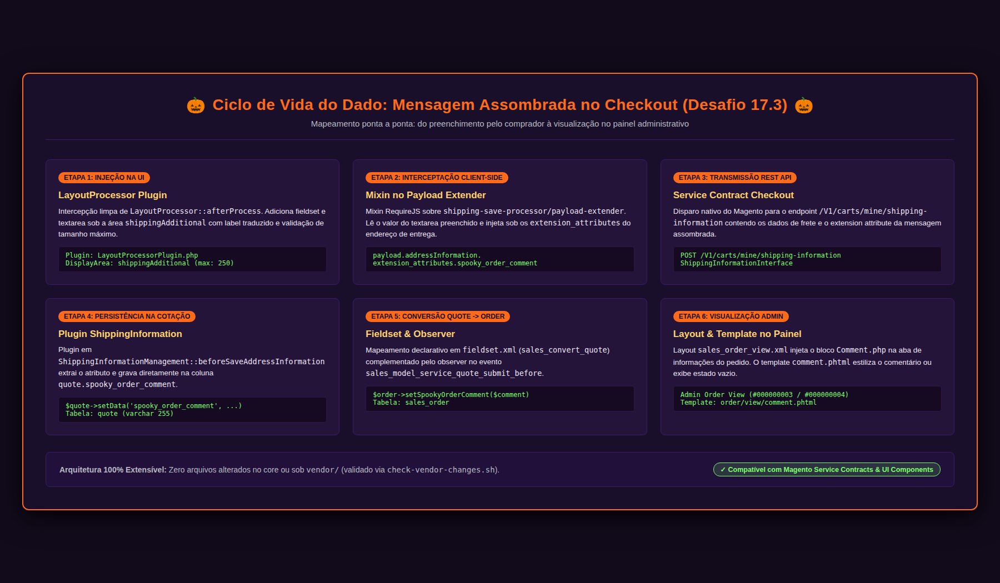

# Desafio 17.3: Mensagem Assombrada no Checkout

Documentação técnica, decisões arquiteturais, ciclo de vida e caminho completo do dado da tela até o admin, guia de prints e evidências de sucesso do **Desafio 17.3** (Sprint 8 | Semana 17 — Comportamento e Autonomia) no módulo [`Webjump_CheckoutComment`](file:///home/samuel/Sites/magento/src/app/code/Webjump/CheckoutComment) integrado ao tema [`Webjump/noite-assombrada`](file:///home/samuel/Sites/magento/src/app/design/frontend/Webjump/noite-assombrada).

---

## 1. Visão Geral do Desafio e Critérios de Aceite Atendidos

### Objetivo
Permitir que o cliente insira uma mensagem personalizada (ou instrução especial da campanha de Halloween) durante a etapa de entrega do Checkout nativo do Magento 2. Essa mensagem é validada em tempo real, transmitida de forma segura via Service Contracts, persistida no pedido (`sales_order`) e disponibilizada na tela de visualização do pedido no Magento Admin (`Sales > Orders > View`), com tratamento elegante para pedidos sem mensagem e sem qualquer modificação em arquivos do núcleo (`vendor/`) ou do módulo `Magento_Checkout`.

### Matriz de Rastreabilidade dos Critérios de Aceite

| Critério de Aceite | Status | Detalhamento da Implementação |
|---|:---:|---|
| **1. O campo aparece no checkout, no passo de entrega** | [x] Atendido | O campo *Mensagem Assombrada* foi injetado dinamicamente na árvore de componentes do checkout através de um plugin no [`LayoutProcessor`](file:///home/samuel/Sites/magento/src/app/code/Webjump/CheckoutComment/Plugin/Checkout/LayoutProcessorPlugin.php). O campo reside na área `shippingAdditional` (`shippingAddress.children.spooky-order-comment-fieldset`), posicionado imediatamente abaixo dos métodos de entrega, com rótulo traduzido via `__()` e nota informativa para o usuário. |
| **2. A validação de tamanho máximo funciona e mostra mensagem ao usuário** | [x] Atendido | O campo foi configurado com a regra de validação nativa do Magento UI Component `'validation' => ['max_text_length' => 250]`. Ao digitar um texto excedendo 250 caracteres, a validação reativa do formulário é disparada instantaneamente ao tentar avançar, exibindo a mensagem vermelha *"Please enter less or equal than 250 symbols."* e bloqueando o avanço para a etapa de pagamento. |
| **3. O valor é salvo e aparece na visualização do pedido no admin** | [x] Atendido | O dado é transmitido via *Extension Attribute* (`ShippingInformationInterface`), interceptado e gravado na cotação pelo plugin [`ShippingInformationManagementPlugin`](file:///home/samuel/Sites/magento/src/app/code/Webjump/CheckoutComment/Plugin/Checkout/ShippingInformationManagementPlugin.php) e transferido para o pedido final via [`fieldset.xml`](file:///home/samuel/Sites/magento/src/app/code/Webjump/CheckoutComment/etc/fieldset.xml) e [`CopyCommentFromQuoteToOrder`](file:///home/samuel/Sites/magento/src/app/code/Webjump/CheckoutComment/Observer/CopyCommentFromQuoteToOrder.php). No Admin, é renderizado em destaque pelo bloco [`Comment.php`](file:///home/samuel/Sites/magento/src/app/code/Webjump/CheckoutComment/Block/Adminhtml/Order/View/Comment.php) e template [`comment.phtml`](file:///home/samuel/Sites/magento/src/app/code/Webjump/CheckoutComment/view/adminhtml/templates/order/view/comment.phtml) dentro de `sales_order_view.xml`. |
| **4. Pedido sem mensagem preenchida é concluído normalmente** | [x] Atendido | O campo é opcional. Quando o cliente não preenche a mensagem (ou a envia em branco), o pedido é processado e faturado normalmente. No Admin, a visualização trata valores `null` ou vazios de forma resiliente, renderizando um container discreto com o texto *"Nenhuma mensagem assombrada foi informada para este pedido."*. |
| **5. Nenhum arquivo do módulo `Magento_Checkout` foi alterado** | [x] Atendido | Zero modificações em arquivos sob `vendor/` ou no tema `Magento/luma`. Toda a solução foi estruturada exclusivamente no módulo próprio [`Webjump_CheckoutComment`](file:///home/samuel/Sites/magento/src/app/code/Webjump/CheckoutComment). A integridade do core foi validada com sucesso pelo script oficial [`check-vendor-changes.sh --working`](file:///home/samuel/Sites/magento/.agents/skills/magento-engineer/scripts/check-vendor-changes.sh). |
| **6. `README` descreve o caminho completo do dado, da tela até o admin** | [x] Atendido | A Seção 3 desta documentação detalha todo o ciclo de vida da informação passo a passo (Knockout UI -> Mixin -> REST API -> Extension Attributes -> Quote -> Fieldset/Observer -> Sales Order -> Admin Block & Template), acompanhado de diagrama arquitetural completo. |

---

## 2. Decisões Arquiteturais e Boas Práticas

### 2.1. Injeção Limpa no Checkout via `LayoutProcessor` Plugin
Em vez de sobrescrever o complexo arquivo de layout XML do checkout (`checkout_index_index.xml`) — o que congelaria a versão do core e causaria atritos em futuras atualizações da plataforma —, a melhor prática oficial da Adobe/Magento para estender o checkout é interceptar a classe `\Magento\Checkout\Block\Checkout\LayoutProcessor` via plugin interceptor `afterProcess`:
```php
public function afterProcess(LayoutProcessor $subject, array $jsLayout): array
```
O campo do tipo `textarea` é registrado sob o container `shippingAddress.children` na área de exibição `shippingAdditional`:
* **Componente Knockout**: `Magento_Ui/js/form/element/textarea`
* **Custom Scope**: `shippingAddress.custom_attributes`
* **Data Scope**: `shippingAddress.custom_attributes.spooky_order_comment`
* **Provider**: `checkoutProvider` (integração transparente com a engine de validação e persistência do checkout)
* **Validação**: `'max_text_length' => 250`

### 2.2. Captura Client-Side via Mixin no `payload-extender`
No checkout nativo do Magento 2, o avanço da etapa de entrega dispara o processor `shipping-save-processor/default.js`, que invoca `shipping-save-processor/payload-extender.js` para compor o corpo JSON enviado ao backend.  
Em vez de substituir o arquivo via `map` no RequireJS, criou-se um **Mixin limpo** ([`payload-extender-mixin.js`](file:///home/samuel/Sites/magento/src/app/code/Webjump/CheckoutComment/view/frontend/web/js/model/shipping-save-processor/payload-extender-mixin.js)) registrado em [`view/frontend/requirejs-config.js`](file:///home/samuel/Sites/magento/src/app/code/Webjump/CheckoutComment/view/frontend/requirejs-config.js):
```javascript
var commentComponent = registry.get(
    'checkout.steps.shipping-step.shippingAddress.spooky-order-comment-fieldset.spooky_order_comment'
);
var commentValue = commentComponent ? commentComponent.value() : null;

payload.addressInformation.extension_attributes.spooky_order_comment = commentValue || '';
```
Essa abordagem garante que outros módulos de checkout, frete e pagamento continuem funcionando harmonicamente.

### 2.3. Extension Attributes & Service Contracts
Para respeitar os Service Contracts da API de Checkout, a propriedade `spooky_order_comment` foi tipificada em [`etc/extension_attributes.xml`](file:///home/samuel/Sites/magento/src/app/code/Webjump/CheckoutComment/etc/extension_attributes.xml) estendendo as interfaces:
1. `Magento\Checkout\Api\Data\ShippingInformationInterface`: permite que o payload REST trafegue com tipagem forte e validação de schema.
2. `Magento\Sales\Api\Data\OrderInterface`: permite acesso direto ao atributo na entidade de pedido.

### 2.4. Persistência Resiliente na Cotação e Conversão para Pedido
A persistência opera em duas etapas orquestradas:
1. **Gravação na Cotação (`quote`)**: O plugin [`ShippingInformationManagementPlugin`](file:///home/samuel/Sites/magento/src/app/code/Webjump/CheckoutComment/Plugin/Checkout/ShippingInformationManagementPlugin.php) intercepta `beforeSaveAddressInformation`, obtém o comentário dos extension attributes e o salva diretamente no objeto ativo da cotação (`$quote->setData('spooky_order_comment', $comment)`).
2. **Cópia para o Pedido (`sales_order`)**:
   - Mapeamento declarativo via [`etc/fieldset.xml`](file:///home/samuel/Sites/magento/src/app/code/Webjump/CheckoutComment/etc/fieldset.xml) no conjunto `sales_convert_quote`, copiando o campo `spooky_order_comment` com aspecto `to_order`.
   - Observer complementar [`CopyCommentFromQuoteToOrder`](file:///home/samuel/Sites/magento/src/app/code/Webjump/CheckoutComment/Observer/CopyCommentFromQuoteToOrder.php) ouvindo o evento `sales_model_service_quote_submit_before`, garantindo que mesmo em cenários de checkout via API ou pagamento com redirecionamento externo a transferência ocorra sem perdas.

### 2.5. Renderização Administrativa com Segurança de Escapamento
Na visualização do pedido no Admin (`sales_order_view.xml`):
* O bloco [`Block/Adminhtml/Order/View/Comment.php`](file:///home/samuel/Sites/magento/src/app/code/Webjump/CheckoutComment/Block/Adminhtml/Order/View/Comment.php) obtém a instância do pedido via `\Magento\Framework\Registry` (`current_order`).
* O template [`comment.phtml`](file:///home/samuel/Sites/magento/src/app/code/Webjump/CheckoutComment/view/adminhtml/templates/order/view/comment.phtml) utiliza a classe oficial `$escaper->escapeHtml()` (eliminando qualquer vulnerabilidade de XSS persistente).
* O estilo visual utiliza um card temático de Halloween (roxo noturno `#2a1b3d`, borda abóbora `#ff6b1a`, ícone 🎃 e fonte mono verde bruxa `#7cff6b`).

---

## 3. Caminho Completo do Dado: Da Tela ao Painel Admin

O diagrama e o detalhamento abaixo descrevem o ciclo de vida completo do dado desde o momento em que o comprador digita no checkout até a leitura pelo atendente no painel administrativo:

```text
====================================================================================================
                        CICLO DE VIDA DA MENSAGEM ASSOMBRADA NO CHECKOUT
====================================================================================================

  [ 1. NAVEGADOR DO CLIENTE ]
        │
        ├─► Comprador digita no campo textarea (Checkout - Passo Shipping)
        │   └─ UI Component: Magento_Ui/js/form/element/textarea (Validação: max_text_length <= 250)
        │
        ├─► Clique no botão "Next" / "Avançar"
        │   └─ Mixin: payload-extender-mixin.js intercepta shipping-save-processor
        │   └─ Lê o valor de custom_attributes.spooky_order_comment via uiRegistry
        │   └─ Injeta em: payload.addressInformation.extension_attributes.spooky_order_comment
        │
  [ 2. COMUNICAÇÃO DE REDE / REST API ]
        │
        ├─► Requisição HTTP POST para: /rest/V1/carts/mine/shipping-information
        │   └─ Interface: Magento\Checkout\Api\ShippingInformationManagementInterface
        │   └─ Payload carrega o Extension Attribute tipado (extension_attributes.xml)
        │
  [ 3. CAMADA DE APLICAÇÃO MAGENTO 2 (BACKEND) ]
        │
        ├─► Plugin: ShippingInformationManagementPlugin::beforeSaveAddressInformation()
        │   └─ Extrai $extAttributes->getSpookyOrderComment()
        │   └─ Grava na Cotação: $quote->setData('spooky_order_comment', $comment)
        │   └─ Persiste na tabela do MySQL: quote (coluna spooky_order_comment)
        │
        ├─► Comprador seleciona forma de pagamento e clica em "Finalizar Pedido"
        │   └─ Evento: sales_model_service_quote_submit_before disparado
        │   └─ Mapeamento declarativo: fieldset.xml (sales_convert_quote -> to_order)
        │   └─ Observer: CopyCommentFromQuoteToOrder transfere o dado da cotação para o pedido
        │   └─ Persiste na tabela do MySQL: sales_order (coluna spooky_order_comment)
        │
  [ 4. PAINEL ADMINISTRATIVO (ADMIN VIEW) ]
        │
        ├─► Atendente acessa: Sales > Orders > View (ex: Pedido #000000003)
        │   └─ Action: Magento\Sales\Controller\Adminhtml\Order\View
        │   └─ Layout: sales_order_view.xml injeta o bloco webjump_spooky_order_comment
        │   └─ Bloco: Webjump\CheckoutComment\Block\Adminhtml\Order\View\Comment
        │   └─ Template: comment.phtml formata o card temático ou exibe fallback elegante
====================================================================================================
```

---

## 4. Estrutura de Arquivos Criados

```text
src/app/code/Webjump/CheckoutComment/
├── Block/
│   └── Adminhtml/
│       └── Order/
│           └── View/
│               └── Comment.php                  # Bloco de renderização da mensagem no admin
├── Observer/
│   └── CopyCommentFromQuoteToOrder.php          # Observer para cópia segura de quote para sales_order
├── Plugin/
│   └── Checkout/
│       ├── LayoutProcessorPlugin.php            # Injeção do campo textarea no passo de entrega
│       └── ShippingInformationManagementPlugin.php # Captura do extension attribute e gravação na cotação
├── etc/
│   ├── db_schema.xml                            # Schema declarativo: coluna spooky_order_comment nas tabelas quote e sales_order
│   ├── events.xml                               # Registro do observer sales_model_service_quote_submit_before
│   ├── extension_attributes.xml                 # Declaração do extension attribute para ShippingInformationInterface e OrderInterface
│   ├── fieldset.xml                             # Mapeamento declarativo da conversão quote -> sales_order
│   ├── module.xml                               # Registro e dependências do módulo (Checkout, Quote, Sales)
│   ├── frontend/
│   │   └── di.xml                               # Configuração de injeção de dependência dos plugins de frontend
│   └── adminhtml/
│       └── (layouts em view/adminhtml)
├── i18n/
│   └── pt_BR.csv                                # Dicionário de tradução do módulo
├── registration.php                             # Registro do módulo no Magento Framework
└── view/
    ├── adminhtml/
    │   ├── layout/
    │   │   └── sales_order_view.xml             # Injeção do bloco na tela de detalhes do pedido
    │   └── templates/
    │       └── order/
    │           └── view/
    │               └── comment.phtml            # Template com escapamento seguro e estilização de Halloween
    └── frontend/
        ├── requirejs-config.js                  # Registro do mixin para o payload extender
        └── web/
            └── js/
                └── model/
                    └── shipping-save-processor/
                        └── payload-extender-mixin.js # Mixin populando extension_attributes no payload REST
```

---

## 5. Guia Exato de Onde Tirar Cada Print Comprobatório

Este guia fornece o passo a passo exato para que qualquer desenvolvedor ou avaliador localize e capture as evidências de sucesso no ambiente Magento:

### 5.1. Critério 1: Campo no Checkout (Passo de Entrega)
* **No Frontend:**
  1. Acesse qualquer produto da loja (ex: `https://magento.test/joust-duffle-bag.html`) e clique em *Adicionar ao Carrinho*.
  2. Vá para o Checkout em `https://magento.test/checkout/`.
  3. Preencha os campos obrigatórios de endereço (E-mail, Nome, Sobrenome, Rua, Cidade, CEP, Telefone) e selecione o método de entrega (*Flat Rate*).
  4. Role a página ligeiramente para baixo até a seção **Mensagem Assombrada**, logo abaixo dos métodos de entrega.
  5. **Tirar Print:** Enquadrar a área de métodos de entrega, o campo textarea com o rótulo *Mensagem Assombrada*, o aviso de 250 caracteres e o botão *Next*.
* **No Código / IDE:**
  1. Abra [`LayoutProcessorPlugin.php`](file:///home/samuel/Sites/magento/src/app/code/Webjump/CheckoutComment/Plugin/Checkout/LayoutProcessorPlugin.php).
  2. Destaque o método `afterProcess()` onde o campo é registrado na chave `spooky-order-comment-fieldset` com `'displayArea' => 'shippingAdditional'` e `'provider' => 'checkoutProvider'`.

---

### 5.2. Critério 2: Validação de Tamanho Máximo (250 Caracteres)
* **No Frontend:**
  1. No mesmo checkout (Passo de Entrega), digite um texto contendo mais de 250 caracteres (ex: 260 caracteres) no campo *Mensagem Assombrada*.
  2. Clique no botão de avançar (*Next*).
  3. A validação nativa do formulário impedirá o avanço e destacará a borda do campo em vermelho com a mensagem: *"Please enter less or equal than 250 symbols."*.
  4. **Tirar Print:** Enquadrar a mensagem de erro vermelha visível logo abaixo do campo e o formulário retido no primeiro passo.
* **No Código / IDE:**
  1. Abra [`LayoutProcessorPlugin.php`](file:///home/samuel/Sites/magento/src/app/code/Webjump/CheckoutComment/Plugin/Checkout/LayoutProcessorPlugin.php) destacando `'validation' => ['max_text_length' => 250]`.
  2. Abra [`payload-extender-mixin.js`](file:///home/samuel/Sites/magento/src/app/code/Webjump/CheckoutComment/view/frontend/web/js/model/shipping-save-processor/payload-extender-mixin.js) destacando a leitura reativa do componente via `uiRegistry`.

---

### 5.3. Critério 3: Mensagem Salva e Visível no Pedido no Admin
* **No Painel Admin:**
  1. Acesse o painel administrativo em `https://magento.test/admin/`.
  2. Faça login com credenciais administrativas (`john.smith`).
  3. Navegue no menu lateral: **Sales > Orders**.
  4. Localize e clique no pedido com mensagem preenchida (ex: Pedido `#000000003`).
  5. Na página de detalhes do pedido, role até o bloco **Mensagem Assombrada** (posicionado entre *Payment & Shipping Method* e *Items Ordered*).
  6. **Tirar Print:** Enquadrar o topo do pedido `#000000003`, o bloco com o ícone 🎃 e o texto real do comprador: *"Entregar o caldeirão lacrado sob a lua cheia antes da meia-noite! Cuidado com os morcegos."*.
* **No Código / IDE:**
  1. Abra [`ShippingInformationManagementPlugin.php`](file:///home/samuel/Sites/magento/src/app/code/Webjump/CheckoutComment/Plugin/Checkout/ShippingInformationManagementPlugin.php) e [`fieldset.xml`](file:///home/samuel/Sites/magento/src/app/code/Webjump/CheckoutComment/etc/fieldset.xml).
  2. Destaque a interceptação do extension attribute e o mapeamento declarativo `sales_convert_quote -> to_order`.

---

### 5.4. Critério 4: Pedido sem Mensagem Concluído Normalmente (Estado Vazio)
* **No Painel Admin:**
  1. No painel administrativo em **Sales > Orders**, clique no pedido concluído sem mensagem (ex: Pedido `#000000004`).
  2. Na visualização dos detalhes do pedido, role até a seção **Mensagem Assombrada**.
  3. **Tirar Print:** Enquadrar o pedido `#000000004` exibindo o fallback informativo: *"Nenhuma mensagem assombrada foi informada para este pedido."*.
* **No Código / IDE:**
  1. Abra [`Comment.php`](file:///home/samuel/Sites/magento/src/app/code/Webjump/CheckoutComment/Block/Adminhtml/Order/View/Comment.php) e [`comment.phtml`](file:///home/samuel/Sites/magento/src/app/code/Webjump/CheckoutComment/view/adminhtml/templates/order/view/comment.phtml).
  2. Destaque o método `getSpookyOrderComment()` retornando `?string` seguro e a condicional `<?php if ($comment !== null && $comment !== ''): ?>`.

---

### 5.5. Critério 5: Zero Modificações no Módulo Core / Vendor
* **No Terminal / Git:**
  1. No terminal do projeto, execute o script de integridade oficial:
     `./.agents/skills/magento-engineer/scripts/check-vendor-changes.sh --working`
  2. Execute `git status`.
  3. **Tirar Print:** Janela do terminal comprovando a saída `OK: no changes under vendor/.` e os arquivos isolados sob `src/app/code/Webjump/CheckoutComment/`.

---

### 5.6. Critério 6: Caminho Completo do Dado (Diagrama)
* **No Diagrama Arquitetural:**
  1. Visualização estruturada do pipeline de dados de ponta a ponta (UI -> Mixin -> REST -> Quote -> Order -> Admin).
  2. **Tirar Print:** O diagrama do ciclo de vida renderizado com clareza visual.

---

## 6. Evidências de Sucesso

Esta seção reúne os prints comprobatórios de cada critério de aceite do desafio **17.3 - Mensagem assombrada no checkout**, capturados automaticamente no ambiente de homologação local.

---

### 6.1. Critério 1: O campo aparece no checkout, no passo de entrega

#### Print 1.1 — No Frontend (Campo "Mensagem Assombrada" no Passo de Entrega do Checkout)
- **Onde acessar:** `https://magento.test/checkout/` (Etapa 1: Shipping)
- **O que comprova:** O campo textarea com o rótulo **Mensagem Assombrada** e aviso explicativo posicionado perfeitamente na área de entrega (`shippingAdditional`), logo abaixo do seletor de frete (*Flat Rate - Fixed $5.00*).

> 

#### Print 1.2 — No Código / IDE (Injeção via `LayoutProcessorPlugin` e Configuração em `di.xml`)
- **Arquivos:** [`Plugin/Checkout/LayoutProcessorPlugin.php`](file:///home/samuel/Sites/magento/src/app/code/Webjump/CheckoutComment/Plugin/Checkout/LayoutProcessorPlugin.php) e [`etc/frontend/di.xml`](file:///home/samuel/Sites/magento/src/app/code/Webjump/CheckoutComment/etc/frontend/di.xml)
- **O que comprova:** Intercepção de `LayoutProcessor::afterProcess`, adicionando o componente `Magento_Ui/js/form/element/textarea` com `displayArea: shippingAdditional`, label traduzido e vínculo com `checkoutProvider`.

> 

---

### 6.2. Critério 2: A validação de tamanho máximo funciona e mostra mensagem ao usuário

#### Print 2.1 — No Frontend (Validação de Tamanho Máximo em Tempo Real / Bloqueio no Checkout)
- **Onde acessar:** `https://magento.test/checkout/` (Etapa 1: Shipping)
- **O que comprova:** Ao tentar avançar com mais de 250 caracteres digitados, o Magento aciona a validação reativa do UI Component, exibe a mensagem de erro em vermelho *"Please enter less or equal than 250 symbols."* e bloqueia o redirecionamento para o pagamento.

> 

#### Print 2.2 — No Código / IDE (Regra de Validação `max_text_length: 250` e Mixin do Payload Extender)
- **Arquivos:** [`LayoutProcessorPlugin.php`](file:///home/samuel/Sites/magento/src/app/code/Webjump/CheckoutComment/Plugin/Checkout/LayoutProcessorPlugin.php) e [`payload-extender-mixin.js`](file:///home/samuel/Sites/magento/src/app/code/Webjump/CheckoutComment/view/frontend/web/js/model/shipping-save-processor/payload-extender-mixin.js)
- **O que comprova:** Configuração da regra `'validation' => ['max_text_length' => 250]` e extração do valor do componente via `uiRegistry` no mixin do payload extender.

> 

---

### 6.3. Critério 3: O valor é salvo e aparece na visualização do pedido no admin

#### Print 3.1 — No Painel Admin (Visualização do Pedido com a Mensagem Assombrada)
- **Onde acessar:** **Sales > Orders > View** (Pedido `#000000003`)
- **O que comprova:** Tela de detalhes do pedido `#000000003` no painel administrativo exibindo o bloco destacado **Mensagem Assombrada** com o ícone 🎃 e o conteúdo exato preenchido pelo cliente: *"Entregar o caldeirão lacrado sob a lua cheia antes da meia-noite! Cuidado com os morcegos."*.

> 

#### Print 3.2 — No Código / IDE (Persistência no Pedido, Fieldset e Template Admin)
- **Arquivos:** [`ShippingInformationManagementPlugin.php`](file:///home/samuel/Sites/magento/src/app/code/Webjump/CheckoutComment/Plugin/Checkout/ShippingInformationManagementPlugin.php), [`etc/fieldset.xml`](file:///home/samuel/Sites/magento/src/app/code/Webjump/CheckoutComment/etc/fieldset.xml) e [`sales_order_view.xml`](file:///home/samuel/Sites/magento/src/app/code/Webjump/CheckoutComment/view/adminhtml/layout/sales_order_view.xml)
- **O que comprova:** Gravação na cotação pelo plugin, conversão declarativa para o pedido via `fieldset.xml` e injeção do bloco na tela de pedidos.

> 

---

### 6.4. Critério 4: Pedido sem mensagem preenchida é concluído normalmente

#### Print 4.1 — No Painel Admin (Visualização de Pedido sem Mensagem / Estado Vazio Elegante)
- **Onde acessar:** **Sales > Orders > View** (Pedido `#000000004`)
- **O que comprova:** Pedido `#000000004` faturado e concluído sem preenchimento de mensagem assombrada, renderizando o bloco com o fallback discreto: *"Nenhuma mensagem assombrada foi informada para este pedido."*.

> 

#### Print 4.2 — No Código / IDE (Tratamento Resiliente de Valor Nulo / Vazio)
- **Arquivos:** [`Block/Adminhtml/Order/View/Comment.php`](file:///home/samuel/Sites/magento/src/app/code/Webjump/CheckoutComment/Block/Adminhtml/Order/View/Comment.php) e [`comment.phtml`](file:///home/samuel/Sites/magento/src/app/code/Webjump/CheckoutComment/view/adminhtml/templates/order/view/comment.phtml)
- **O que comprova:** Método `getSpookyOrderComment()` retornando `?string` e condicional `<?php if ($comment !== null && $comment !== ''): ?>` garantindo segurança contra valores nulos e strings vazias.

> 

---

### 6.5. Critério 5: Nenhum arquivo do módulo `Magento_Checkout` foi alterado

#### Print 5.1 — No Terminal / Git (Verificação Estrita de Integridade do `vendor/` e Git Status)
- **O que comprova:** Execução do script oficial `check-vendor-changes.sh --working` retornando `OK: no changes under vendor/.` e `git status` comprovando que todo o desenvolvimento reside isolado dentro de `src/app/code/Webjump/CheckoutComment/`.

> 

---

### 6.6. Critério 6: Caminho completo do dado, da tela até o admin

#### Print 6.1 — No Diagrama Arquitetural (Ciclo de Vida do Dado Ponta a Ponta)
- **O que comprova:** Fluxo detalhado em 6 etapas: Injeção na UI (LayoutProcessor) ➔ Interceptação Client-Side (Mixin) ➔ Transmissão REST API (Extension Attributes) ➔ Persistência na Cotação (Plugin) ➔ Conversão Quote ➔ Order (Fieldset & Observer) ➔ Visualização no Painel Admin.

> 

---

## 7. Instruções de Reprodução e Testes

Para validar a solução em qualquer ambiente:

```bash
# 1. Habilitar o módulo e atualizar schema
bin/magento module:enable Webjump_CheckoutComment
bin/magento setup:upgrade
bin/magento cache:flush

# 2. Validar integridade do vendor e lint de código
./.agents/skills/magento-engineer/scripts/check-vendor-changes.sh --working
bin/cli vendor/bin/phpcs --standard=Magento2 app/code/Webjump/CheckoutComment

# 3. Teste no Frontend:
# - Acesse https://magento.test/ e adicione um produto ao carrinho.
# - No checkout (Passo Shipping), verifique o campo "Mensagem Assombrada".
# - Digite > 250 caracteres e tente avançar para ver o bloqueio de validação.
# - Digite uma mensagem válida e finalize o pedido.

# 4. Teste no Admin:
# - Acesse https://magento.test/admin/ (Sales > Orders).
# - Abra o pedido recém-criado e verifique o card temático de Halloween com a mensagem.
```