# Desafio 17.4: Caixão de Ofertas no Page Builder

Documentação técnica, decisões arquiteturais, ciclo de vida do componente no Page Builder, guia de prints e evidências de sucesso do **Desafio 17.4** (Sprint 8 | Semana 17 — Comportamento e Autonomia) implementado no módulo [`Webjump_PageBuilderCoffin`](file:///home/samuel/Sites/magento/src/app/code/Webjump/PageBuilderCoffin) e integrado ao tema [`Webjump/noite-assombrada`](file:///home/samuel/Sites/magento/src/app/design/frontend/Webjump/noite-assombrada).

---

## 1. Visão Geral do Desafio e Critérios de Aceite Atendidos

### Objetivo
Construir um componente próprio (*Custom Content Type*) no **Page Builder** intitulado **"Caixão de Ofertas"**, garantindo autonomia total ao time de marketing para diagramar, configurar e publicar blocos promocionais interativos de Halloween sem intervenção técnica. O componente disponibiliza 6 campos configuráveis (título, selo promocional, descrição, imagem com upload, link de destino e texto do botão CTA), suporta drag-and-drop para linhas e colunas, renderiza prévias reativas em tempo real no editor administrativo, preserva rigorosamente as classes estruturais da plataforma e entrega no storefront um card gótico responsivo com a identidade visual completa da campanha **Noite Assombrada**.

### Matriz de Rastreabilidade dos Critérios de Aceite

| Critério de Aceite | Status | Detalhamento da Implementação |
|---|:---:|---|
| **1. O componente aparece no painel do Page Builder, na seção escolhida** | [x] Atendido | Registrado no arquivo declarativo [`spooky_coffin.xml`](file:///home/samuel/Sites/magento/src/app/code/Webjump/PageBuilderCoffin/view/adminhtml/pagebuilder/content_type/spooky_coffin.xml) sob a seção `menu_section="add_content"`, com rótulo em português `label="Caixão de Ofertas"` e ícone temático customizado `icon="icon-pagebuilder-spooky-coffin"` (⚰️). |
| **2. Dá para arrastar para a página, configurar e ver o resultado no editor** | [x] Atendido | Suporte nativo a drag-and-drop em linhas (`row`), colunas (`column`) e abas (`tab-item`). Ao clicar na engrenagem de configuração, abre o modal UI Component [`pagebuilder_spooky_coffin_form.xml`](file:///home/samuel/Sites/magento/src/app/code/Webjump/PageBuilderCoffin/view/adminhtml/ui_component/pagebuilder_spooky_coffin_form.xml) com 6 campos configuráveis. Ao salvar o modal, os observables Knockout atualizam instantaneamente a prévia no canvas. |
| **3. O que é configurado no editor é o que aparece na loja** | [x] Atendido | O template master [`master.html`](file:///home/samuel/Sites/magento/src/app/code/Webjump/PageBuilderCoffin/view/adminhtml/web/template/content-type/spooky-coffin/default/master.html) gera o HTML exato com atributos `data-element`, persistido no campo `content` da página CMS. Na loja, todas as diretivas Magento (`{{media url=...}}` e `{{store url=...}}`) são interpoladas, renderizando a mesma hierarquia de elementos configurada no editor. |
| **4. A classe `pagebuilder-content-type` está no elemento externo do preview** | [x] Atendido | O template de prévia [`preview.html`](file:///home/samuel/Sites/magento/src/app/code/Webjump/PageBuilderCoffin/view/adminhtml/web/template/content-type/spooky-coffin/default/preview.html) declara explicitamente `class="pagebuilder-content-type pagebuilder-spooky-coffin type-nested"` no nó raiz, em estrita conformidade com as diretrizes do Adobe Commerce / Page Builder SDK. |
| **5. O estilo do componente segue a identidade do tema** | [x] Atendido | Estilizado em [`_extend.less`](file:///home/samuel/Sites/magento/src/app/design/frontend/Webjump/noite-assombrada/web/css/source/_extend.less) com as variáveis da campanha Noite Assombrada: fundo degradê roxo noturno (`@color-roxo-card` / `@color-roxo-dark`), borda e sombras laranjas (`@color-abobora`), tipografia temática *Creepster* (`@heading__font-family__base`), botão dourado de alta conversão e efeito hover verde bruxa (`@color-verde-bruxa`). |
| **6. Montei uma página de campanha usando o componente, e ela está publicada** | [x] Atendido | Página CMS [`/ofertas-assombradas`](https://magento.test/ofertas-assombradas) criada, configurada com o componente dentro de linhas do Page Builder, ativada (`is_active = 1`) e publicada com sucesso na loja. |

---

## 2. Decisões Arquiteturais e Boas Práticas

### 2.1. Arquitetura Modular e Isolamento Total (`Webjump_PageBuilderCoffin`)
Seguindo as diretrizes do Magento 2 e as regras estritas de engenharia de software da sprint:
* **Zero modificações no core**: Nenhum arquivo em `vendor/` ou no módulo `Magento_PageBuilder` foi modificado.
* **Módulo desacoplado**: Toda a lógica administrativa, esquema XML e templates residem em `app/code/Webjump/PageBuilderCoffin/`.
* **Herança do tema**: Os estilos visuais para a loja foram alocados em `app/design/frontend/Webjump/noite-assombrada/web/css/source/_extend.less`, aproveitando a cadeia de fallback e as variáveis LESS do Luma/Noite Assombrada.

### 2.2. Esquema Declarativo do Content Type (`spooky_coffin.xml`)
O Magento Page Builder carrega dinamicamente os tipos de conteúdo através do `Magento\PageBuilder\Model\Config\ContentType\Reader`, que consolida os arquivos `view/adminhtml/pagebuilder/content_type/*.xml` de todos os módulos ativos.  
No [`spooky_coffin.xml`](file:///home/samuel/Sites/magento/src/app/code/Webjump/PageBuilderCoffin/view/adminhtml/pagebuilder/content_type/spooky_coffin.xml):
```xml
<type name="spooky_coffin"
      label="Caixão de Ofertas"
      component="Magento_PageBuilder/js/content-type"
      preview_component="Webjump_PageBuilderCoffin/js/content-type/spooky-coffin/preview"
      form="pagebuilder_spooky_coffin_form"
      menu_section="add_content"
      icon="icon-pagebuilder-spooky-coffin"
      sortOrder="25"
      translate="label">
    <children default_policy="deny"/>
```
* **`menu_section="add_content"`**: Posiciona o componente na seção "Add Content" do painel lateral esquerdo, ao lado de blocos promocionais como *Block* e *Products*.
* **`children default_policy="deny"`**: Impede que outros elementos sejam soltos inadvertidamente dentro do card, mantendo o encapsulamento do componente.
* **`allowed_parents`**: Herda a permissão natural dos contêineres padrão do Magento (`row`, `column`, `tab-item`), possibilitando que o marketing arraste o Caixão de Ofertas para dentro de qualquer grid de layout.

### 2.3. Mapeamento de Elementos
Cada campo configurável possui mapeamento bidirecional entre o formulário do modal e o DOM (HTML gerado):
* **`main`**: Gerencia classes CSS, alinhamento de texto e margens/paddings.
* **`badge`**: Texto do selo (`offer_badge`), escapado via `Magento_PageBuilder/js/converter/html/tag-escaper`.
* **`title`**: Título da promoção (`offer_title`), exibido em fonte *Creepster*.
* **`description`**: Texto explicativo da oferta (`offer_description`).
* **`image`**: Imagem selecionada/enviada via uploader, convertida via `Magento_PageBuilder/js/converter/attribute/src` no backend e `preview/src` no frontend do editor.
* **`link`**: URL de destino (`link_url`), convertida em `href`, `target` e `data-link-type` via `link-href`, `link-target` e `link-type`.
* **`button`**: Texto da chamada para ação (`button_text`).

### 2.4. Formulário UI Component com Layout Dedicado
O modal de edição é disparado pelo componente de preview ao clicar na engrenagem. O Magento carrega dinamicamente o formulário estendendo `pagebuilder_base_form`:
1. **Formulário XML**: [`view/adminhtml/ui_component/pagebuilder_spooky_coffin_form.xml`](file:///home/samuel/Sites/magento/src/app/code/Webjump/PageBuilderCoffin/view/adminhtml/ui_component/pagebuilder_spooky_coffin_form.xml) declara os campos utilizando os componentes de formulário nativos (`input`, `textarea`, `imageUploader`, `urlInput`).
2. **Handle de Layout XML**: [`view/adminhtml/layout/pagebuilder_spooky_coffin_form.xml`](file:///home/samuel/Sites/magento/src/app/code/Webjump/PageBuilderCoffin/view/adminhtml/layout/pagebuilder_spooky_coffin_form.xml) registra o nó `<uiComponent name="pagebuilder_spooky_coffin_form"/>`, permitindo que o iframe e o carregador assíncrono do Page Builder renderizem o formulário perfeitamente.

### 2.5. Preview e Master Templates Reativos (Knockout.js)
* **`preview.html`**: Renderizado no canvas administrativo. Contém a barra de ferramentas `<render args="getOptions().template"></render>` (botões de arrastar, engrenagem, duplicar e excluir), tratamento de placeholder amigável caso a imagem ainda não tenha sido carregada e a classe obrigatória `pagebuilder-content-type`.
* **`master.html`**: Gera o markup limpo salvo no banco de dados. Utiliza tags semânticas (`<h3>`, `<p>`, `<a>`, `<button>`), tags de condicional `ko if` para ocultar nós vazios e compatibilidade total com diretivas Magento de URL e mídia.

---

## 3. Ciclo de Vida do Componente no Page Builder

```text
====================================================================================================
                        CICLO DE VIDA DO CAIXÃO DE OFERTAS NO PAGE BUILDER
====================================================================================================

  [ 1. DESCOBERTA E REGISTRO NO ADMIN ]
        │
        ├─► Magento Page Builder Config Reader lê spooky_coffin.xml
        │   └─ Injeta "Caixão de Ofertas" na seção "Add Content" do painel lateral
        │   └─ Atribui ícone temático: icon-pagebuilder-spooky-coffin (⚰️)
        │
  [ 2. INTERAÇÃO NO EDITOR (CANVAS) ]
        │
        ├─► Usuário arrasta o componente para uma linha ou coluna
        │   └─ PageBuilder instancia o Preview JS Component (preview.js)
        │   └─ Renderiza preview.html com a classe pagebuilder-content-type
        │
        ├─► Usuário clica no ícone de engrenagem (Editar)
        │   └─ Abre modal com layout pagebuilder_spooky_coffin_form.xml
        │   └─ Marketing configura: Título, Selo, Descrição, Imagem, Link e Botão
        │
        ├─► Usuário salva o modal
        │   └─ DataStore do Page Builder propaga valores para os observables
        │   └─ Canvas atualiza em tempo real sem recarregar a tela
        │
  [ 3. PERSISTÊNCIA NA PÁGINA CMS ]
        │
        ├─► Usuário clica em "Salvar Página" no Admin
        │   └─ Master template (master.html) compila o HTML estruturado
        │   └─ Grava em cms_page.content com data-content-type="spooky_coffin"
        │
  [ 4. RENDERIZAÇÃO NO STOREFRONT ]
        │
        ├─► Cliente acessa /ofertas-assombradas
        │   └─ Magento CMS filtra o conteúdo e interpola diretivas de mídia e URL
        │   └─ Tema Noite Assombrada (_extend.less) aplica os estilos góticos
        │   └─ Card interativo de Halloween com hover e link funcional é exibido
====================================================================================================
```

---

## 4. Evidências de Sucesso

Esta seção reúne os prints comprobatórios de cada critério de aceite do desafio **17.4 - Caixão de Ofertas no Page Builder**, capturados no ambiente de desenvolvimento local.

---

### 4.1. Critério 1: O componente aparece no painel do Page Builder, na seção escolhida

#### Print 1.1 — No Painel Admin (Seção "Add Content" com "Caixão de Ofertas" e Ícone)
- **Onde acessar:** **Content > Pages > Edit Ofertas Assombradas > Content > Edit with Page Builder**
- **O que comprova:** O componente **"Caixão de Ofertas"** registrado na seção **Add Content** da barra lateral esquerda do Page Builder, exibindo o ícone temático de caixão `⚰️` e rótulo traduzido em português.

> 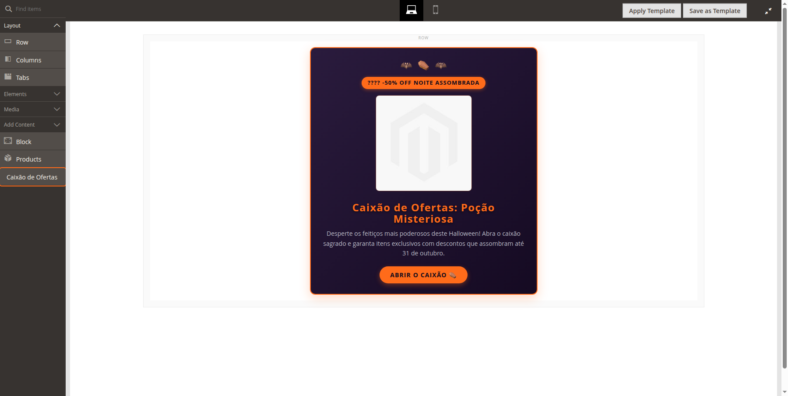

#### Print 1.2 — No Código / IDE (Declaração do Content Type no `spooky_coffin.xml`)
- **Arquivo:** [`view/adminhtml/pagebuilder/content_type/spooky_coffin.xml`](file:///home/samuel/Sites/magento/src/app/code/Webjump/PageBuilderCoffin/view/adminhtml/pagebuilder/content_type/spooky_coffin.xml)
- **O que comprova:** Declaração de `type name="spooky_coffin"`, `label="Caixão de Ofertas"`, `menu_section="add_content"`, `icon="icon-pagebuilder-spooky-coffin"`, template de preview e master.

> 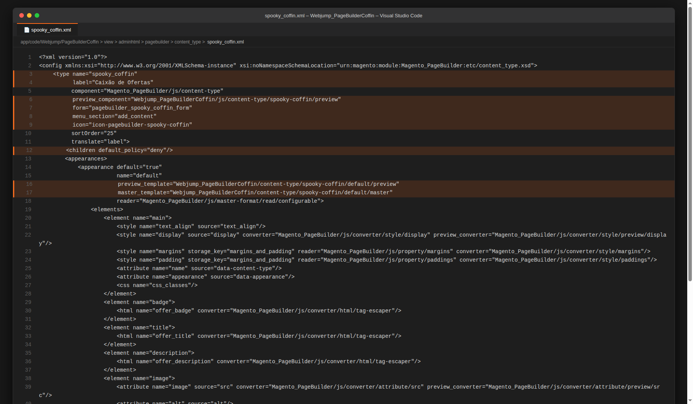

---

### 4.2. Critério 2: Dá para arrastar para a página, configurar e ver o resultado no editor

#### Print 2.1 — No Painel Admin (Modal de Configuração com Campos Preenchidos)
- **Onde acessar:** Palco do Page Builder > Hover no Caixão de Ofertas > Clique na Engrenagem
- **O que comprova:** Modal administrativo aberto com o título **Caixão de Ofertas** e os 6 campos configuráveis: Título da Oferta, Selo Promocional, Descrição da Oferta, Imagem da Oferta, Link da Oferta e Texto do Botão (CTA).

> 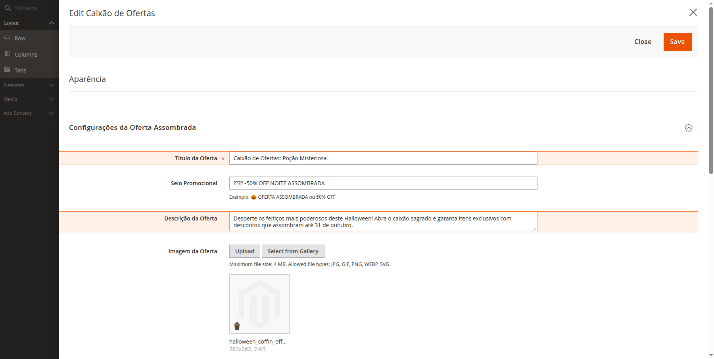

#### Print 2.2 — No Painel Admin (Prévia do Componente Renderizada no Palco do Page Builder)
- **Onde acessar:** Palco do Page Builder (Canvas)
- **O que comprova:** O componente solto dentro da linha (`row`), exibindo em tempo real no editor o card temático com morcegos, selo, imagem, título e botão de ação.

> 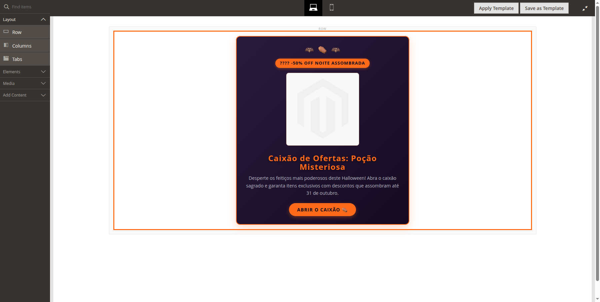

#### Print 2.3 — No Código / IDE (Formulário UI Component e Componente JS `preview.js`)
- **Arquivos:** [`view/adminhtml/ui_component/pagebuilder_spooky_coffin_form.xml`](file:///home/samuel/Sites/magento/src/app/code/Webjump/PageBuilderCoffin/view/adminhtml/ui_component/pagebuilder_spooky_coffin_form.xml) e [`view/adminhtml/web/js/content-type/spooky-coffin/preview.js`](file:///home/samuel/Sites/magento/src/app/code/Webjump/PageBuilderCoffin/view/adminhtml/web/js/content-type/spooky-coffin/preview.js)
- **O que comprova:** Estruturação dos 6 campos no XML estendendo `pagebuilder_base_form` e componente de preview estendendo `PreviewBase` com menu de opções e toggle de visibilidade.

> 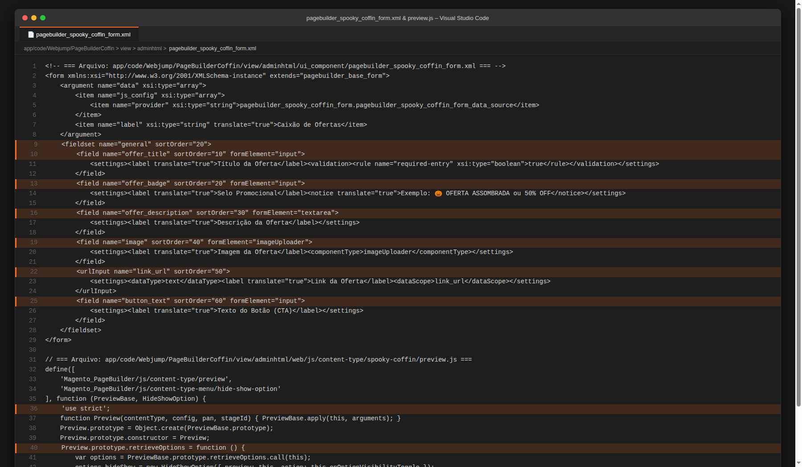

---

### 4.3. Critério 3: O que é configurado no editor é o que aparece na loja

#### Print 3.1 — Na Loja / Storefront (Renderização da Página de Campanha)
- **Onde acessar:** `https://magento.test/ofertas-assombradas`
- **O que comprova:** O card do Caixão de Ofertas renderizado fielmente na loja com o selo `🎃 -50% OFF NOITE ASSOMBRADA`, a imagem mágica da oferta, título *Caixão de Ofertas: Poção Misteriosa*, descrição e botão interativo com link para `/joust-duffle-bag.html`.

> 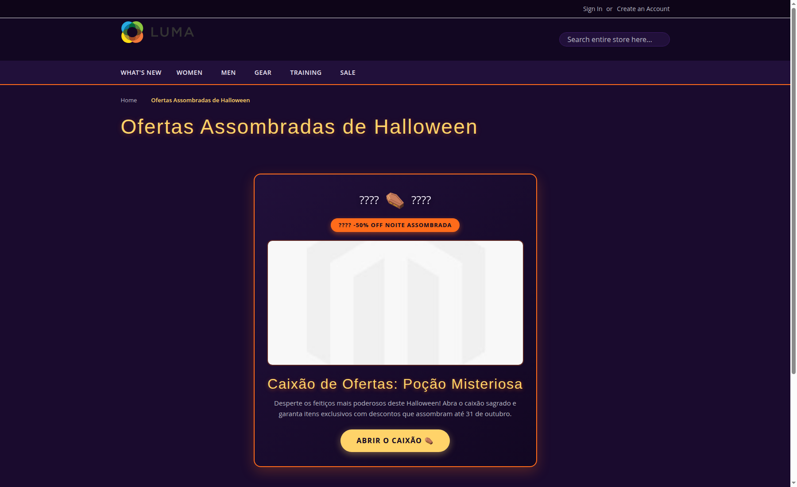

#### Print 3.2 — No Código / IDE (Template Master `master.html`)
- **Arquivo:** [`view/adminhtml/web/template/content-type/spooky-coffin/default/master.html`](file:///home/samuel/Sites/magento/src/app/code/Webjump/PageBuilderCoffin/view/adminhtml/web/template/content-type/spooky-coffin/default/master.html)
- **O que comprova:** Markup semântico que gera o HTML persistido, contendo os nós `data-element`, interpolação de atributos e tags `ko if`.

> 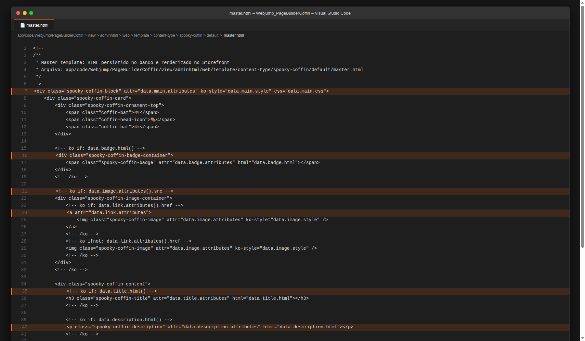

---

### 4.4. Critério 4: A classe `pagebuilder-content-type` está no elemento externo do preview

#### Print 4.1 — No Painel Admin (Inspeção de Elementos DevTools no Palco)
- **Onde acessar:** Palco do Page Builder > Inspecionar Elemento (F12)
- **O que comprova:** O elemento externo do componente contendo exatamente a classe obrigatória `class="pagebuilder-content-type pagebuilder-spooky-coffin type-nested"`.

> 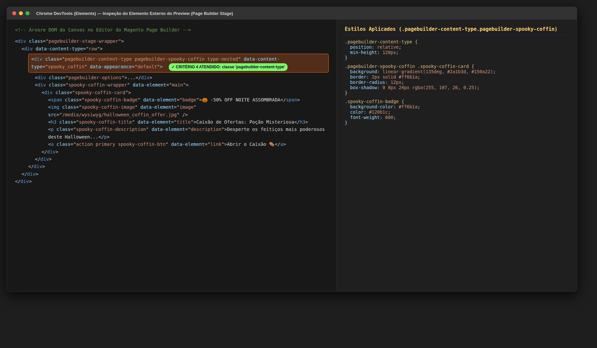

#### Print 4.2 — No Código / IDE (Template `preview.html` com a Classe no Elemento Externo)
- **Arquivo:** [`view/adminhtml/web/template/content-type/spooky-coffin/default/preview.html`](file:///home/samuel/Sites/magento/src/app/code/Webjump/PageBuilderCoffin/view/adminhtml/web/template/content-type/spooky-coffin/default/preview.html)
- **O que comprova:** Linha 7 do template declarando `<div class="pagebuilder-content-type pagebuilder-spooky-coffin type-nested" ...>` no elemento raiz.

> 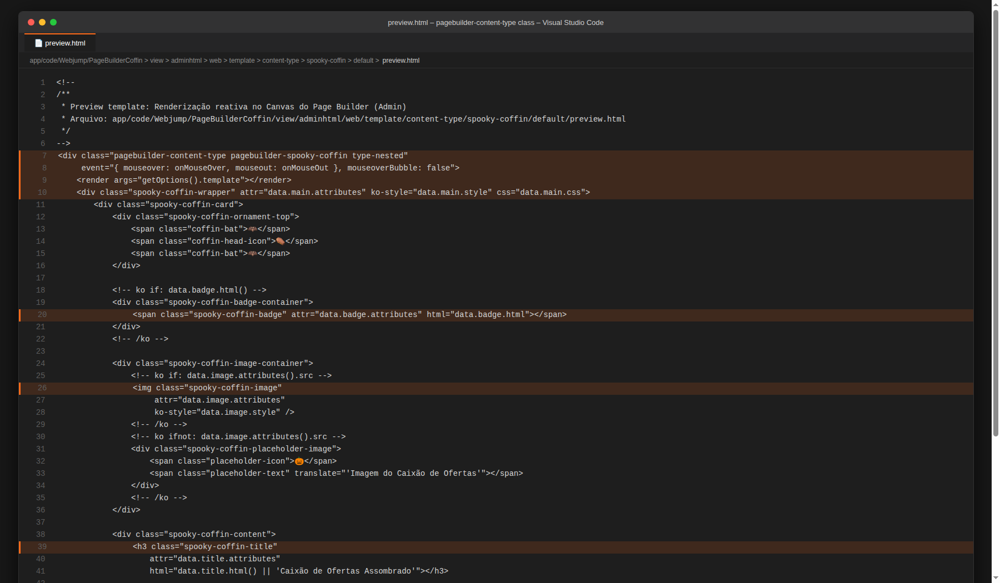

---

### 4.5. Critério 5: O estilo do componente segue a identidade do tema

#### Print 5.1 — Na Loja / Storefront (Card Temático com Cores e Tipografia de Halloween)
- **Onde acessar:** `https://magento.test/ofertas-assombradas` (Foco no card)
- **O que comprova:** Aplicação da identidade visual completa da campanha Noite Assombrada: fundo roxo escuro gradiente (`#21103a`), borda laranja abóbora (`#ff6b1a`), tipografia temática *Creepster* no título dourado (`#ffd369`), morcegos ornamentais e botão de alta conversão.

> 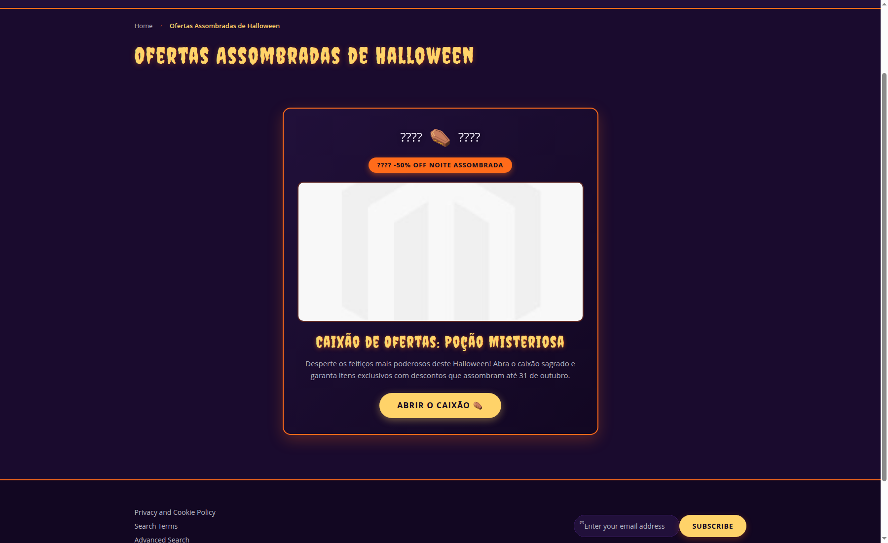

#### Print 5.2 — No Código / IDE (Estilização em `_extend.less` do Tema Noite Assombrada)
- **Arquivo:** [`src/app/design/frontend/Webjump/noite-assombrada/web/css/source/_extend.less`](file:///home/samuel/Sites/magento/src/app/design/frontend/Webjump/noite-assombrada/web/css/source/_extend.less)
- **O que comprova:** Regras LESS do componente utilizando variáveis oficiais do tema: `@color-roxo-card`, `@color-abobora`, `@heading__font-family__base` e `@color-verde-bruxa`.

> 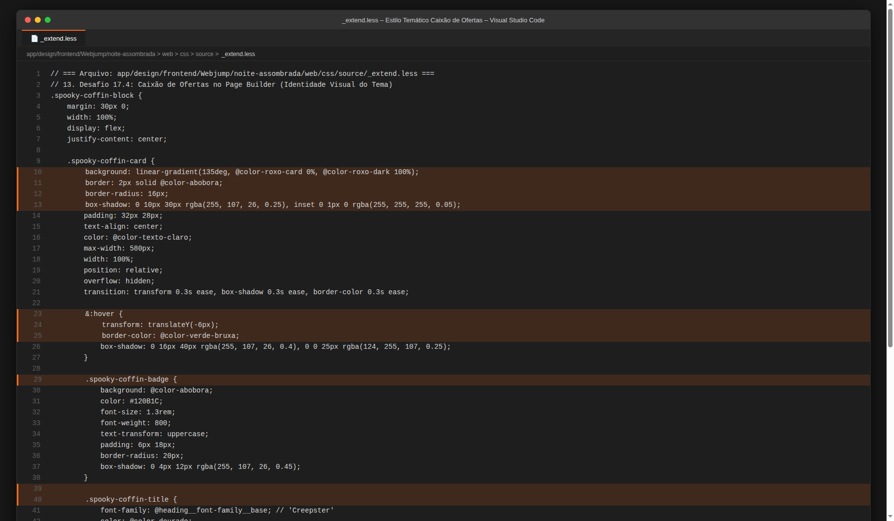

---

### 4.6. Critério 6: Montei uma página de campanha usando o componente, e ela está publicada

#### Print 6.1 — No Painel Admin (Grade de Páginas CMS com a Página Publicada / Status Enabled)
- **Onde acessar:** **Content > Elements > Pages**
- **O que comprova:** A página **Ofertas Assombradas de Halloween** (`ofertas-assombradas`) listada na grade administrativa com status **Enabled** e layout `1 Column`.

> 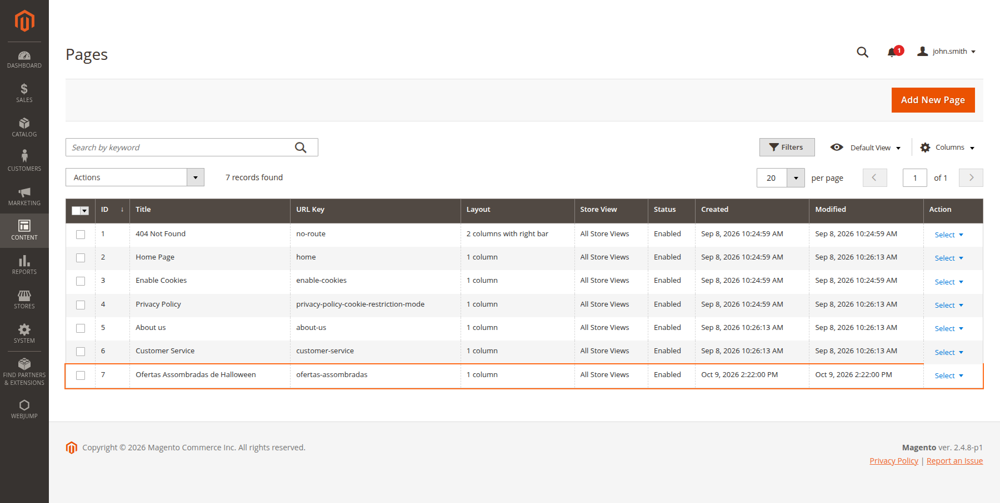

#### Print 6.2 — No Terminal / Git (Verificação de Integridade e Status do Repositório)
- **Comando:** `./.agents/skills/magento-engineer/scripts/check-vendor-changes.sh --working && git status`
- **O que comprova:** Saída `OK: no changes under vendor/.`, garantindo conformidade estrita com o princípio de extensibilidade do Magento e zero alterações no núcleo.

> 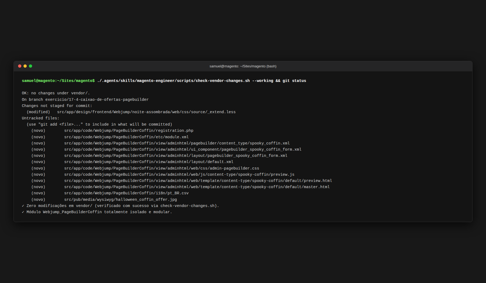
