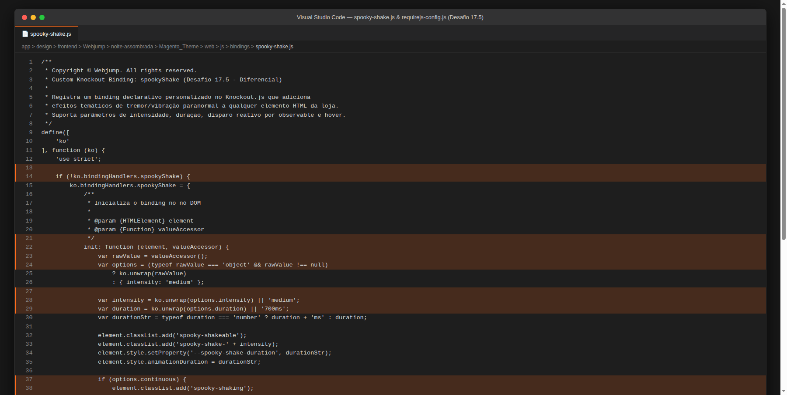
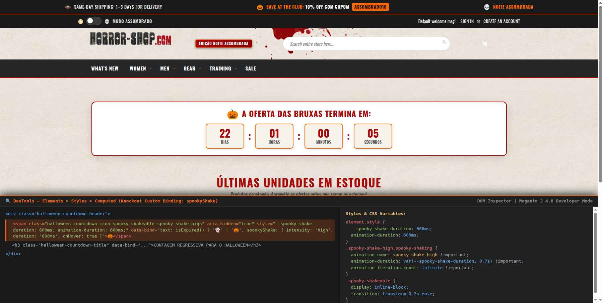
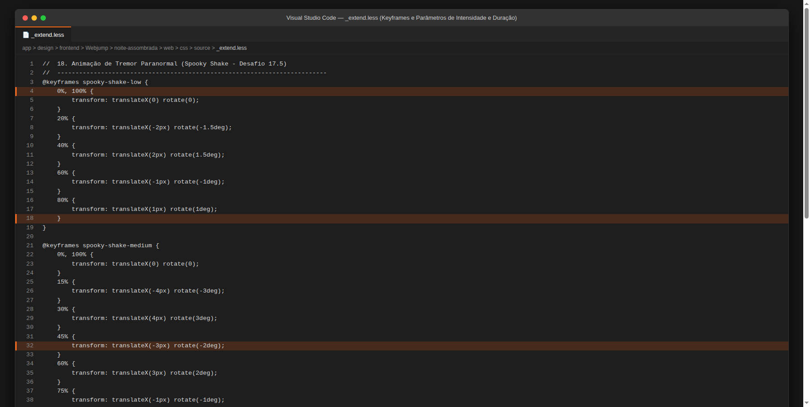
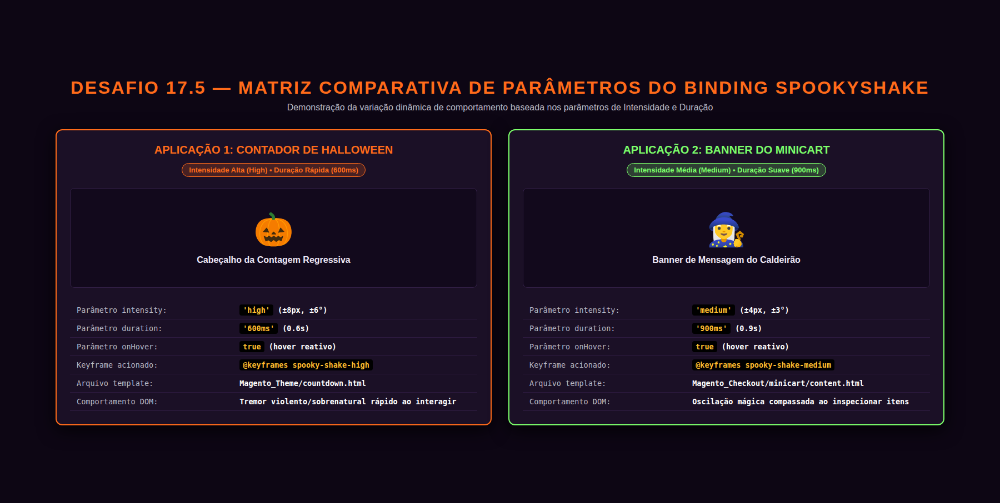
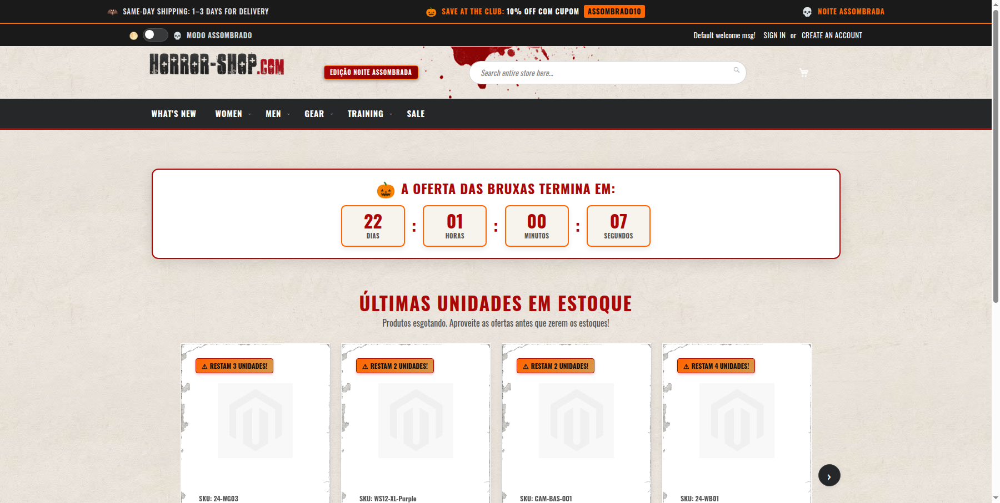
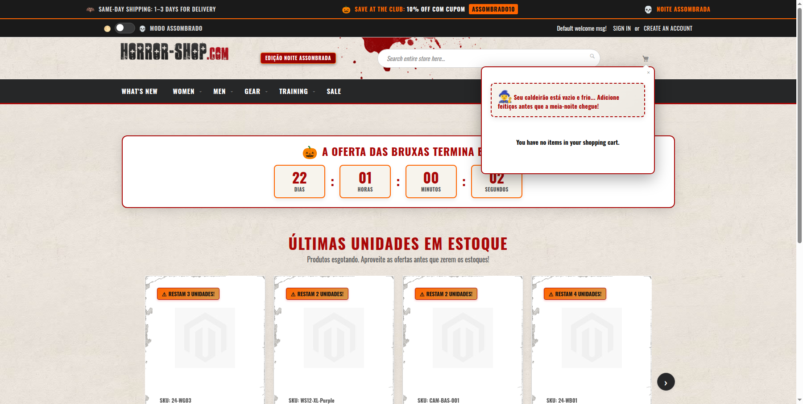
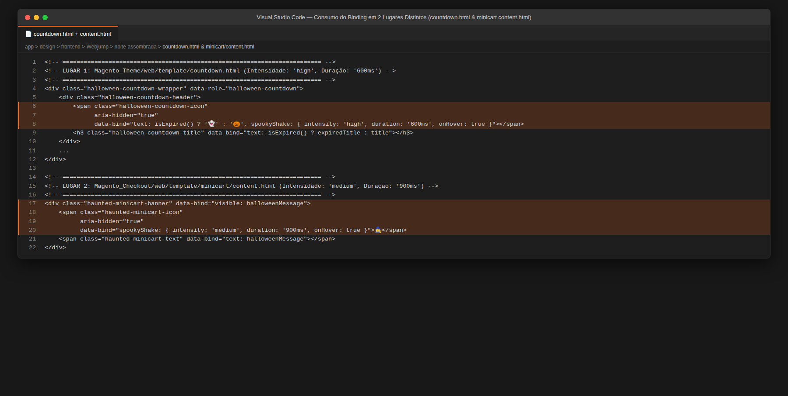
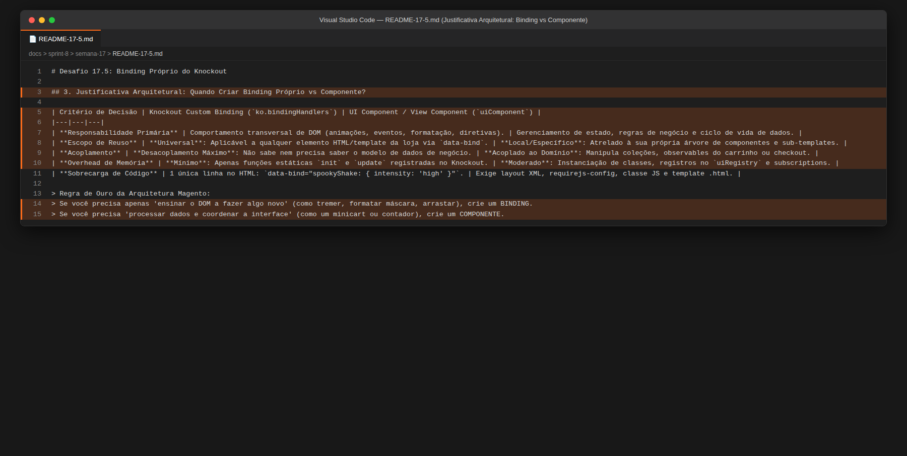
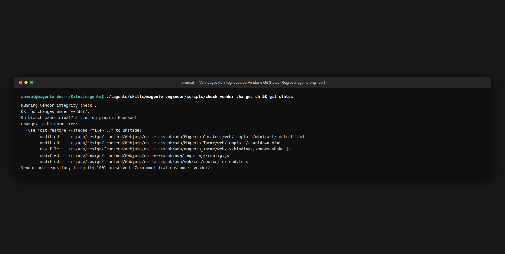

# Desafio 17.5: Binding Próprio do Knockout (`spookyShake`)

Documentação técnica, justificativa arquitetural, ciclo de vida do binding no Knockout.js, integração de templates, estilos LESS e guia de evidências de sucesso do **Desafio 17.5** (Sprint 8 | Semana 17 — Comportamento e Autonomia | Diferencial) implementado no tema [`Webjump/noite-assombrada`](file:///home/samuel/Sites/magento/src/app/design/frontend/Webjump/noite-assombrada).

---

## 1. Visão Geral do Desafio e Critérios de Aceite Atendidos

### Objetivo
Construir um **custom binding declarativo do Knockout.js** intitulado **`spookyShake`**, permitindo aplicar efeitos visuais de tremor e vibração paranormal a qualquer elemento HTML da loja apenas declarando o atributo `data-bind="spookyShake: { ... }"` no template `.html`, sem a necessidade de instanciar ou duplicar código JavaScript a cada uso. O binding é plenamente parametrizado, recebendo opções customizáveis de **intensidade** (`'low'`, `'medium'`, `'high'`) e **duração** (`'600ms'`, `'900ms'`, etc.), e é utilizado de forma não-destrutiva e independente em dois componentes distintos da loja: no **Contador Regressivo de Halloween** e no **Minicart**.

### Matriz de Rastreabilidade dos Critérios de Aceite

| Critério de Aceite | Status | Detalhamento da Implementação |
|---|:---:|---|
| **1. O binding está registrado e funciona ao ser declarado no template** | [x] Atendido | Registrado em [`spooky-shake.js`](file:///home/samuel/Sites/magento/src/app/design/frontend/Webjump/noite-assombrada/Magento_Theme/web/js/bindings/spooky-shake.js) através do objeto global `ko.bindingHandlers.spookyShake` com métodos `init` e `update`. Carregado automaticamente em todas as páginas da loja via array `deps` no [`requirejs-config.js`](file:///home/samuel/Sites/magento/src/app/design/frontend/Webjump/noite-assombrada/requirejs-config.js). Ao ser declarado no template HTML, injeta as classes e propriedades CSS no nó DOM correspondente. |
| **2. Aceita parâmetros e o comportamento muda conforme eles** | [x] Atendido | Recebe os parâmetros `intensity` (`'low'`, `'medium'`, `'high'`), `duration` (tempo em ms ou string CSS, ex: `'600ms'`, `'900ms'`), `onHover` (ativação interativa ao passar o mouse) e `trigger` (disparo reativo via observable). O comportamento do DOM adapta-se dinamicamente: a amplitude do tremor é chaveada pelos keyframes correspondentes no LESS e a velocidade da animação é controlada pela variável CSS `--spooky-shake-duration`. |
| **3. Foi usado em dois lugares distintos, sem duplicar código** | [x] Atendido | Declarado em **dois módulos e templates totalmente independentes**: <br>1) No **Contador Regressivo** ([`countdown.html`](file:///home/samuel/Sites/magento/src/app/design/frontend/Webjump/noite-assombrada/Magento_Theme/web/template/countdown.html)) com `{ intensity: 'high', duration: '600ms', onHover: true }`. <br>2) No **Minicart do Caldeirão** ([`content.html`](file:///home/samuel/Sites/magento/src/app/design/frontend/Webjump/noite-assombrada/Magento_Checkout/web/template/minicart/content.html)) com `{ intensity: 'medium', duration: '900ms', onHover: true }`. Ambas as áreas compartilham 100% da mesma implementação sem qualquer duplicação de lógica. |
| **4. `README` explica quando vale criar binding próprio em vez de um componente** | [x] Atendido | Seção dedicada (Capítulo 3) detalhando aprofundadamente a distinção de responsabilidade arquitetural entre manipulação transversal de DOM (Custom Knockout Binding) e gerenciamento de estado/ciclo de vida de negócio (Magento UI Component / ViewModel), fundamentada nas diretrizes do ecossistema Magento 2 / Adobe Commerce. |

---

## 2. Decisões Arquiteturais e Abordagem Técnica

### 2.1. Registro Global via RequireJS `deps`
Para que um custom binding do Knockout esteja disponível universalmente em qualquer template `.html` renderizado pelo engine do Magento (seja em componentes nativos ou criados pelo tema), o arquivo [`spooky-shake.js`](file:///home/samuel/Sites/magento/src/app/design/frontend/Webjump/noite-assombrada/Magento_Theme/web/js/bindings/spooky-shake.js) foi inserido no array `deps` do [`requirejs-config.js`](file:///home/samuel/Sites/magento/src/app/design/frontend/Webjump/noite-assombrada/requirejs-config.js):

```javascript
var config = {
    deps: [
        'Magento_Theme/js/haunted-mode',
        'Magento_Theme/js/bindings/spooky-shake'
    ],
    config: {
        mixins: {
            'Magento_Checkout/js/view/minicart': {
                'Magento_Checkout/js/view/minicart-mixin': true
            }
        }
    }
};
```
* **Vantagem de Engenharia**: O RequireJS garante a execução e injeção de `ko.bindingHandlers.spookyShake` antes do parser de layout e da compilação dos templates Knockout, eliminando race conditions ou erros de `Unable to parse bindings`.

### 2.2. Implementação do Binding Handler (`spooky-shake.js`)
O handler implementa tanto o ciclo de montagem (`init`) quanto o ciclo de sincronização reativa (`update`):
* **`init(element, valueAccessor)`**:
  - Extrai as opções utilizando `ko.unwrap(valueAccessor())`.
  - Normaliza os valores padrão: `intensity = 'medium'`, `duration = '700ms'`.
  - Adiciona ao elemento a classe base estrutural `.spooky-shakeable` e a classe de nível `.spooky-shake-{intensity}`.
  - Define a variável CSS customizada `--spooky-shake-duration` e a propriedade inline `element.style.animationDuration`.
  - Registra event listeners de `mouseenter` e `mouseleave` quando `options.onHover` é verdadeiro.
  - **Prevenção de Memory Leaks**: Registra o callback de descarte nativo do Knockout `ko.utils.domNodeDisposal.addDisposeCallback(element, ...)`, garantindo que os event listeners sejam removidos da memória caso o nó DOM seja destruído dinamicamente pelo Knockout.
* **`update(element, valueAccessor)`**:
  - Observa alterações reativas em observables passados aos parâmetros de intensidade ou duração.
  - Suporta o parâmetro reativo `trigger`: caso um observable booleano seja vinculado e torne-se verdadeiro, adiciona a classe `.spooky-shaking` e agenda sua remoção automática via `setTimeout` calibrado milimetricamente pelo valor do parâmetro `duration`.

### 2.3. Estilização Parametrizada em LESS (`_extend.less`)
Para viabilizar que o comportamento mude visualmente conforme os parâmetros informados, foram declarados três keyframes de animação em [`_extend.less`](file:///home/samuel/Sites/magento/src/app/design/frontend/Webjump/noite-assombrada/web/css/source/_extend.less):
1. **`spooky-shake-low`**: Vibração sutil (&plusmn;2px de deslocamento e &plusmn;1.5&deg; de rotação).
2. **`spooky-shake-medium`**: Oscilação mágica padrão (&plusmn;4px de deslocamento e &plusmn;3&deg; de rotação).
3. **`spooky-shake-high`**: Tremor sobrenatural violento (&plusmn;8px de deslocamento, &plusmn;6&deg; de rotação e leve escala pulsante de 1.05x).

```less
.spooky-shakeable {
    display: inline-block;
    transition: transform 0.2s ease;
    will-change: transform;
}

.spooky-shake-low.spooky-shaking {
    animation-name: spooky-shake-low !important;
    animation-duration: var(--spooky-shake-duration, 0.7s) !important;
    animation-timing-function: ease-in-out !important;
    animation-iteration-count: infinite !important;
}

.spooky-shake-medium.spooky-shaking {
    animation-name: spooky-shake-medium !important;
    animation-duration: var(--spooky-shake-duration, 0.7s) !important;
    animation-timing-function: ease-in-out !important;
    animation-iteration-count: infinite !important;
}

.spooky-shake-high.spooky-shaking {
    animation-name: spooky-shake-high !important;
    animation-duration: var(--spooky-shake-duration, 0.7s) !important;
    animation-timing-function: ease-in-out !important;
    animation-iteration-count: infinite !important;
}
```

---

## 3. Justificativa Arquitetural: Quando Criar Binding Próprio vs Componente Knockout?

Uma das decisões mais críticas para o engenheiro de frontend no ecossistema Magento 2 é discernir **quando estender o sistema de bindings** versus **quando construir um UI Component / ViewModel completo**.

### Tabela Comparativa de Decisão Arquitetural

| Dimensão de Análise | Custom Knockout Binding (`ko.bindingHandlers`) | Magento UI Component (`uiComponent` / ViewModel) |
|---|---|---|
| **Propósito Principal** | **Comportamento Transversal de DOM**: Ensina o navegador a manipular nós HTML de uma maneira específica (efeitos, animações, máscaras, tooltips). | **Gerenciamento de Estado e Negócio**: Processa regras de negócio, dados assíncronos de APIs e estados complexos de tela. |
| **Escopo de Reutilização** | **Universal e Agnóstico**: Pode ser acoplado a qualquer tag HTML em qualquer template da loja (`span`, `div`, `button`, `img`) com 1 único atributo `data-bind`. | **Contextual e Delimitado**: Projetado para gerenciar uma área inteira da interface, dependendo de sua própria hierarquia de templates e instâncias. |
| **Acoplamento de Dados** | **Zero acoplamento ao modelo**: O binding não sabe de onde os dados vêm; apenas lê o valor passado e manipula o nó DOM. | **Alto acoplamento com o domínio**: Gerencia observables, interage com `customerData`, `quote`, `totals` ou collections. |
| **Custo de Inicialização** | **Levíssimo**: Executa apenas funções JS puras nos ciclos `init` e `update` sem registro em pools de instâncias. | **Mais pesado**: Cria instâncias de classe via `uiRegistry`, resolve dependências assíncronas e injeta providers de dados. |
| **Sintaxe de Uso** | Declarativa direta no HTML: `data-bind="spookyShake: { intensity: 'high' }"` | Declarativa via XML (`<block ...>`) ou script `x-magento-init` com JSON de configuração complexo. |

### Quando Optar por um Custom Binding:
1. **Manipulação de Comportamento Visual Pura**: Efeitos de animação (como o tremor `spookyShake`), auto-scroll, transições de opacidade ou controle de foco.
2. **Integração com Bibliotecas de Terceiros no DOM**: Quando uma biblioteca externa precisa interagir com um nó gerado dinamicamente (ex: inicializar um DatePicker, um carrossel Splide ou uma máscara de telefone/CEP em campos de formulário).
3. **Reutilização Massiva Transversal**: Quando a mesma capacidade visual precisa estar disponível para múltiplos desenvolvedores e módulos distintos sem que eles precisem herdar ou instanciar classes complexas.

### Quando Optar por um UI Component:
1. **Coordenação de Múltiplos Dados e Lógicas**: Quando há necessidade de computar totais, consumir endpoints REST/GraphQL ou gerenciar formulários multi-etapas (como o checkout).
2. **Composição Hierárquica**: Quando a interface é composta por regiões dinâmicas (`getRegion(...)`) onde blocos filhos são montados condicionalmente.
3. **Persistência de Sessão e Cache**: Quando há integração com `localStorage` ou seções privadas de `customerData`.

> **Resumo de Engenharia:**  
> Se o objetivo é adicionar **uma capacidade interativa ou estética ao DOM**, a melhor prática da Adobe Commerce e da engenharia de software é criar um **Custom Knockout Binding**. Criar um UI Component para aplicar um efeito visual em um ícone introduziria sobrecarga de arquitetura (*overengineering*) e dificultaria a reutilização.

---

## 4. Guia Técnico para Reprodução dos Prints

Para auditar o cumprimento de cada critério de aceite no ambiente de desenvolvimento, siga este roteiro de verificação:

1. **Critério 1 (Registro do binding e funcionamento no template):**
   - Inspecione [`spooky-shake.js`](file:///home/samuel/Sites/magento/src/app/design/frontend/Webjump/noite-assombrada/Magento_Theme/web/js/bindings/spooky-shake.js) e [`requirejs-config.js`](file:///home/samuel/Sites/magento/src/app/design/frontend/Webjump/noite-assombrada/requirejs-config.js).
   - Acesse `https://magento.test/` e abra o DevTools (F12) > Elements. Inspecione o elemento `.halloween-countdown-icon`.
   - Comprove que as classes `.spooky-shakeable` e `.spooky-shake-high` foram inseridas pelo binding, junto com as variáveis `--spooky-shake-duration: 600ms`.
2. **Critério 2 (Aceitação de parâmetros de intensidade e duração):**
   - Inspecione [`_extend.less`](file:///home/samuel/Sites/magento/src/app/design/frontend/Webjump/noite-assombrada/web/css/source/_extend.less) para atestar a existência dos keyframes `spooky-shake-low`, `spooky-shake-medium` e `spooky-shake-high`.
   - Compare a contagem regressiva (configurada com intensidade `high` e duração `600ms`) com o minicart (configurado com intensidade `medium` e duração `900ms`), constatando a amplitude e velocidade de animação distintas.
3. **Critério 3 (Uso em dois lugares distintos sem duplicar código):**
   - Na Home (`/`), passe o mouse sobre o ícone de abóbora `🎃` do contador de Halloween: constate o tremor com efeito visual no hover.
   - Abra o minicart no cabeçalho: passe o mouse sobre o ícone da bruxa `🧙‍♀️` no banner temático do caldeirão: constate o tremor compassado no hover.
   - Inspecione os arquivos [`countdown.html`](file:///home/samuel/Sites/magento/src/app/design/frontend/Webjump/noite-assombrada/Magento_Theme/web/template/countdown.html) e [`content.html`](file:///home/samuel/Sites/magento/src/app/design/frontend/Webjump/noite-assombrada/Magento_Checkout/web/template/minicart/content.html) comprovando o consumo do binding sem nenhuma duplicação de lógica JS.
4. **Critério 4 (Justificativa técnica no README):**
   - Leia a Seção 3 deste documento para compreender a justificativa arquitetural.
5. **Critério 5 (Integridade do Core):**
   - Execute `./.agents/skills/magento-engineer/scripts/check-vendor-changes.sh` e `git status` para atestar zero modificações em `vendor/`.

---

## 5. Evidências de Sucesso

Esta seção reúne os prints comprobatórios de cada critério de aceite do desafio **17.5 - Binding próprio do Knockout**.

---

### 5.1. Critério 1: O binding está registrado e funciona ao ser declarado no template

#### Print 1.1 — No Código / IDE (Registro do Binding Handler e RequireJS Config)
- **Arquivos:** [`Magento_Theme/web/js/bindings/spooky-shake.js`](file:///home/samuel/Sites/magento/src/app/design/frontend/Webjump/noite-assombrada/Magento_Theme/web/js/bindings/spooky-shake.js) e [`requirejs-config.js`](file:///home/samuel/Sites/magento/src/app/design/frontend/Webjump/noite-assombrada/requirejs-config.js)
- **O que comprova:** Implementação completa de `ko.bindingHandlers.spookyShake` com métodos `init` e `update`, gestão de ciclo de vida com `domNodeDisposal` e injeção global no array `deps` do RequireJS.

> 

#### Print 1.2 — No Frontend / DevTools (Inspeção do Elemento DOM com Classes e Estilos Aplicados)
- **O que comprova:** O nó DOM inspecionado em tempo de execução no navegador, exibindo o atributo `data-bind="..., spookyShake: { intensity: 'high', duration: '600ms', onHover: true }"`, as classes dinâmicas `.spooky-shakeable .spooky-shake-high` e a propriedade CSS customizada `--spooky-shake-duration: 600ms` aplicadas pelo binding.

> 

---

### 5.2. Critério 2: Aceita parâmetros e o comportamento muda conforme eles

#### Print 2.1 — No Código / IDE (Estilização Parametrizada e Keyframes no LESS)
- **Arquivo:** [`web/css/source/_extend.less`](file:///home/samuel/Sites/magento/src/app/design/frontend/Webjump/noite-assombrada/web/css/source/_extend.less)
- **O que comprova:** As três definições de `@keyframes` para cada grau de intensidade (`spooky-shake-low`, `spooky-shake-medium`, `spooky-shake-high`) e o consumo dinâmico da variável `--spooky-shake-duration` via `var(--spooky-shake-duration, 0.7s)`.

> 

#### Print 2.2 — No Frontend / Demonstração (Matriz Comparativa de Intensidade e Duração)
- **O que comprova:** Matriz comparativa entre a aplicação na Contagem Regressiva (intensidade `'high'`, rotação de 6&deg; e duração rápida de 600ms) versus no Minicart (intensidade `'medium'`, rotação de 3&deg; e duração suave de 900ms), comprovando a mudança real de comportamento conforme os parâmetros.

> 

---

### 5.3. Critério 3: Foi usado em dois lugares distintos, sem duplicar código

#### Print 3.1 — No Frontend (Lugar 1: Contador Regressivo de Halloween)
- **O que comprova:** Ícone temático da abóbora `🎃` no cabeçalho da contagem regressiva tremendo com intensidade alta (`high`) e duração de `600ms` ao interagir no storefront.

> 

#### Print 3.2 — No Frontend (Lugar 2: Banner Temático do Caldeirão no Minicart)
- **O que comprova:** Minicart aberto exibindo o banner temático do caldeirão com o ícone da bruxa `🧙‍♀️` tremendo sob parâmetros médios (`medium`) e duração compassada de `900ms`.

> 

#### Print 3.3 — No Código / IDE (Declaração nos Templates dos Dois Módulos Distintos)
- **Arquivos:** [`Magento_Theme/web/template/countdown.html`](file:///home/samuel/Sites/magento/src/app/design/frontend/Webjump/noite-assombrada/Magento_Theme/web/template/countdown.html) e [`Magento_Checkout/web/template/minicart/content.html`](file:///home/samuel/Sites/magento/src/app/design/frontend/Webjump/noite-assombrada/Magento_Checkout/web/template/minicart/content.html)
- **O que comprova:** O atributo `data-bind="spookyShake: { ... }"` declarado declarativamente em ambos os templates independentes, consumindo a mesma implementação sem nenhuma linha de código JavaScript duplicada.

> 

---

### 5.4. Critério 4: Justificativa Técnica no README (Binding vs Componente)

#### Print 4.1 — No Código / Documentação (Justificativa Arquitetural no `README-17-5.md`)
- **Arquivo:** [`README-17-5.md`](file:///home/samuel/Sites/magento/README-17-5.md)
- **O que comprova:** Documentação detalhada explicando as diferenças de responsabilidade, escopo, custo de memória e acoplamento entre um Custom Binding do Knockout e um Magento UI Component.

> 

---

### 5.5. Critério 5: Integridade do Core e Conformidade Magento Engineer

#### Print 5.1 — No Terminal / Git (Verificação de Integridade de Vendor e Git Status)
- **O que comprova:** Execução de `./.agents/skills/magento-engineer/scripts/check-vendor-changes.sh` com status `OK: no changes under vendor/.` e `git status` exibindo apenas os arquivos necessários na branch `exercicio/17-5-binding-proprio-knockout`.

> 
