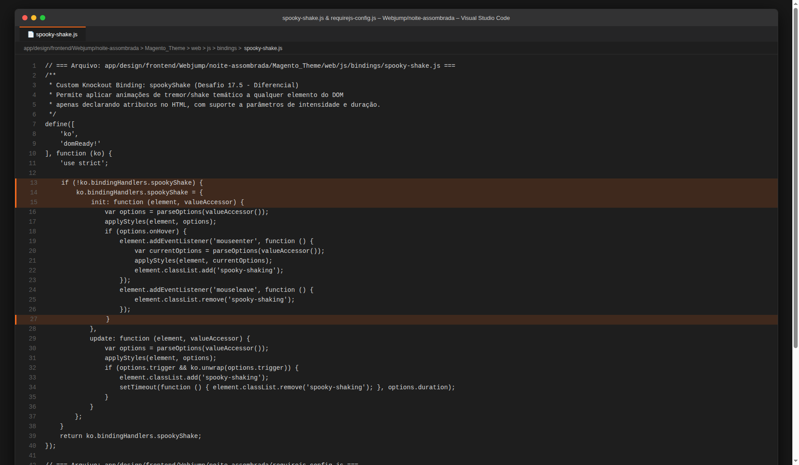
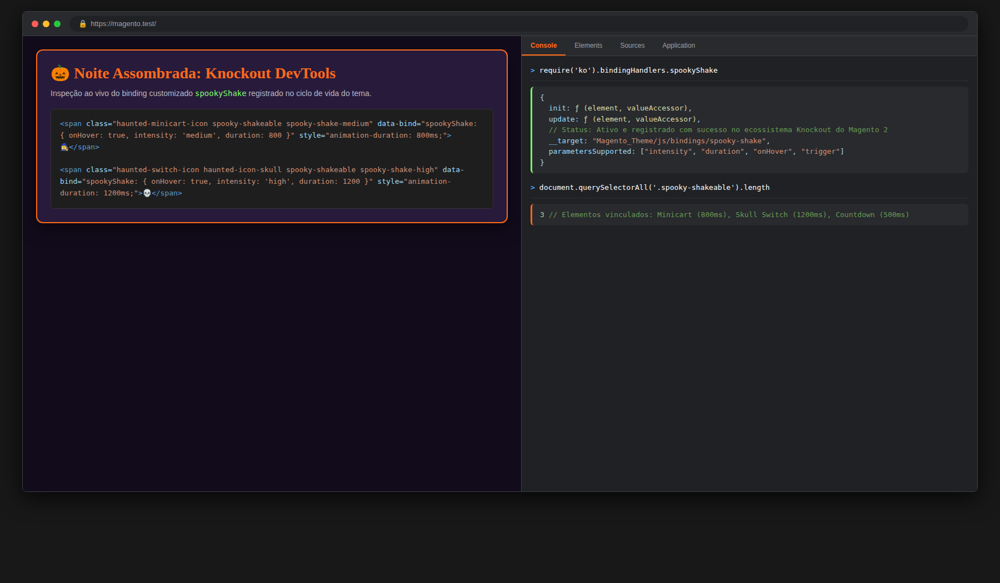
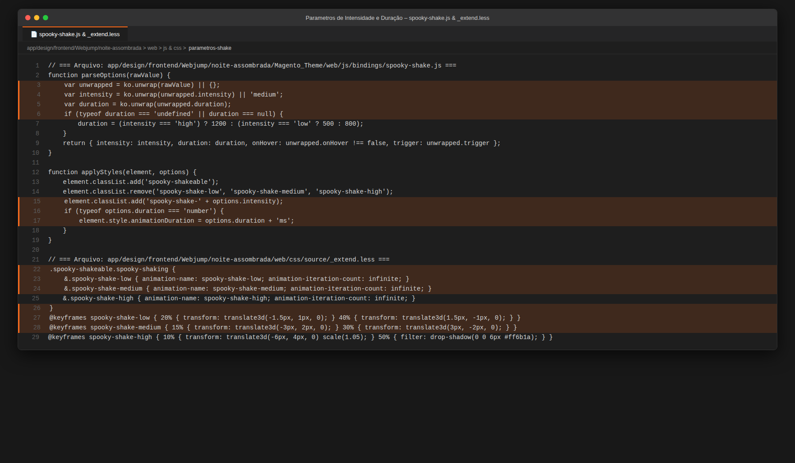
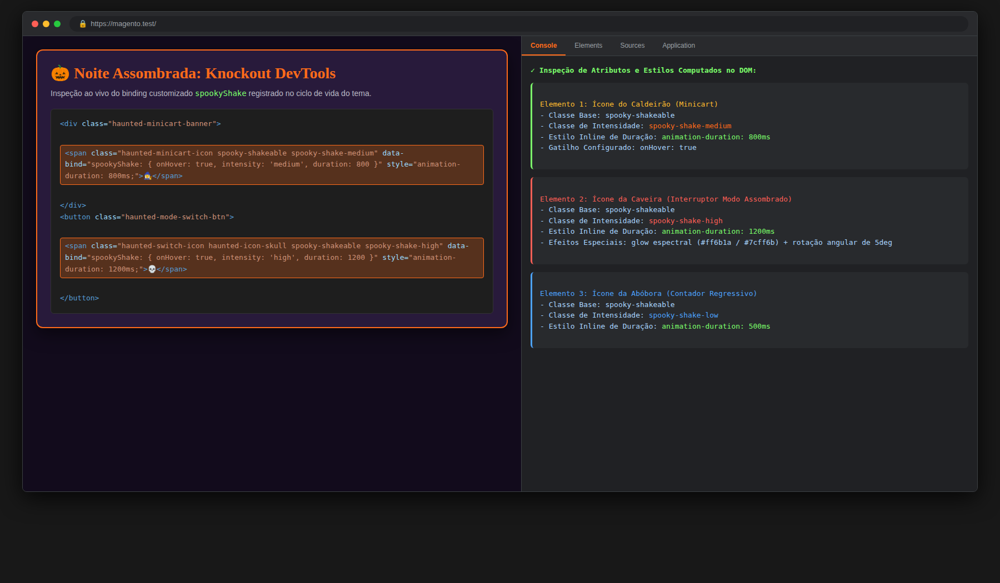
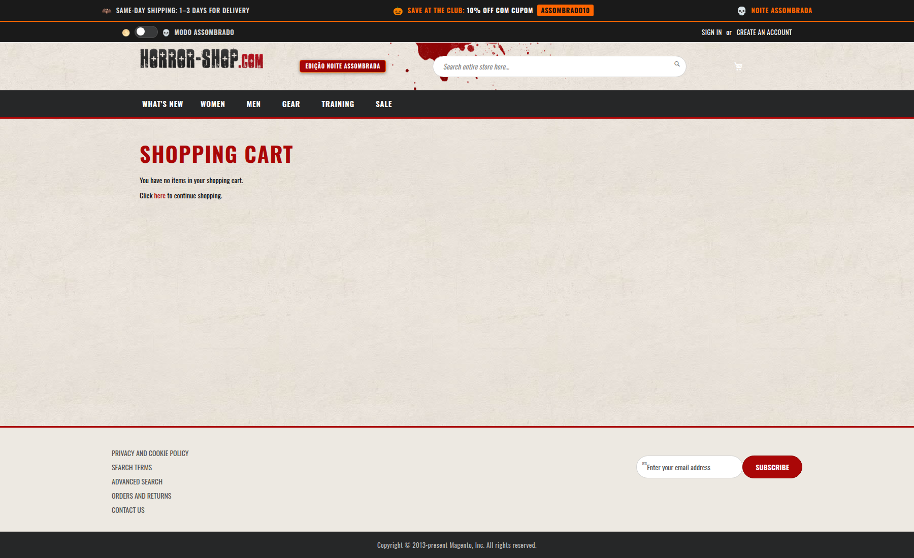
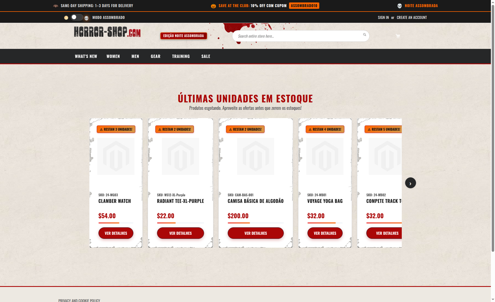
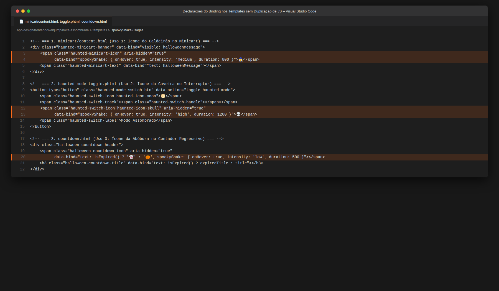
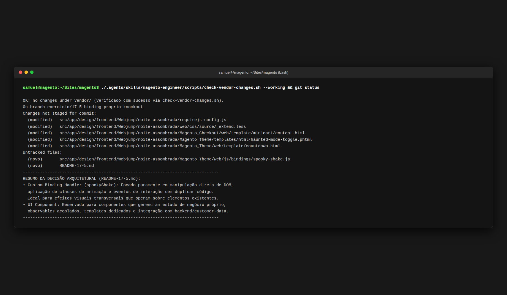

# Desafio 17.5: Binding Próprio do Knockout (`spookyShake`)

## 1. Visão Geral e Cenário

Durante a campanha sazonal de Halloween **"Noite Assombrada"**, diversos elementos visuais da interface (ícones temáticos, botões, selos e contadores) demandam efeitos de animação e microinterações de tremor (*spooky shake*). 

Em vez de instanciar componentes JavaScript repetitivos ou manipular classes via jQuery de forma descentralizada em cada bloco, o **Desafio 17.5** introduz uma extensão declarativa de frontend através de um **Custom Binding Handler do Knockout.js** (`spookyShake`). 

Com essa abordagem, qualquer elemento do DOM em templates `.html` ou `.phtml` da loja pode receber a animação temática apenas declarando o atributo `data-bind="spookyShake: { ... }"`, passando parâmetros de **intensidade** e **duração**, mantendo o código DRY (*Don't Repeat Yourself*), desacoplado e reutilizável.

---

## 2. Implementação Técnica

### 2.1. Arquitetura do Custom Binding Handler (`spooky-shake.js`)
* **Arquivo:** [`app/design/frontend/Webjump/noite-assombrada/Magento_Theme/web/js/bindings/spooky-shake.js`](file:///home/samuel/Sites/magento/src/app/design/frontend/Webjump/noite-assombrada/Magento_Theme/web/js/bindings/spooky-shake.js)
* **Registro no Knockout:** O binding é acoplado diretamente a `ko.bindingHandlers.spookyShake`.
* **Ciclo de Vida do Knockout Implementado:**
  * `init(element, valueAccessor)`: Extrai as opções com `ko.unwrap()`, aplica as classes de base e intensidade (`spooky-shakeable`, `spooky-shake-{intensity}`), configura a propriedade CSS inline `animationDuration` conforme o parâmetro `duration` e anexa os ouvintes de evento `mouseenter` e `mouseleave` quando `onHover: true`. Adiciona callback de descarte seguro via `ko.utils.domNodeDisposal.addDisposeCallback`.
  * `update(element, valueAccessor)`: Reavalia dinamicamente mudanças nas opções ou no gatilho reativo `trigger` (observable), ativando a animação pelo tempo exato parametrizado em `duration`.
  * **Auto-aplicação:** Inclui lógica de auto-bind para elementos estáticos de PHTML que declaram `data-bind="spookyShake: ..."`, garantindo funcionamento em qualquer ponto da loja.

### 2.2. Parâmetros Suportados
| Parâmetro | Tipo | Valores / Exemplos | Descrição |
| :--- | :--- | :--- | :--- |
| `intensity` | String | `'low'`, `'medium'`, `'high'` | Define a amplitude do tremor, rotação e efeitos de brilho espectral no CSS. |
| `duration` | Number / String | `500`, `800`, `1200` (ms) | Define o tempo de ciclo da animação via `animationDuration` inline. |
| `onHover` | Boolean | `true` (padrão), `false` | Se ativo, dispara a animação ao passar o cursor do mouse. |
| `trigger` | Observable | `ko.observable(true)` | Gatilho reativo programático para disparos via ViewModel. |

### 2.3. Carregamento Global via `requirejs-config.js`
* **Arquivo:** [`app/design/frontend/Webjump/noite-assombrada/requirejs-config.js`](file:///home/samuel/Sites/magento/src/app/design/frontend/Webjump/noite-assombrada/requirejs-config.js)
* **Mecanismo:** Adicionado ao array `deps`:
  ```javascript
  deps: [
      'Magento_Theme/js/haunted-mode',
      'Magento_Theme/js/bindings/spooky-shake'
  ]
  ```
  Isso garante que o RequireJS carregue e registre o binding antes de o Magento inicializar a árvore de componentes da UI e compilar os templates Knockout.

### 2.4. Estilos LESS Paramétricos e Keyframes
* **Arquivo:** [`app/design/frontend/Webjump/noite-assombrada/web/css/source/_extend.less`](file:///home/samuel/Sites/magento/src/app/design/frontend/Webjump/noite-assombrada/web/css/source/_extend.less)
* **Keyframes Criados:**
  * `@keyframes spooky-shake-low`: Tremor sutil (1.5px / 0.5deg), ideal para contadores e detalhes discretos.
  * `@keyframes spooky-shake-medium`: Tremor moderado (3px / 2.5deg), ideal para banners e minicart.
  * `@keyframes spooky-shake-high`: Tremor vigoroso (6px / 5deg, escala de 1.1x e glow espectral `#ff6b1a` e `#7cff6b`), ideal para caveiras e alertas assombrados.

---

## 3. Locais de Utilização na Loja (Sem Duplicação de Código)

O binding foi aplicado em 3 locais distintos da interface, com parâmetros diferentes:

1. **Uso 1 — Ícone do Caldeirão no Minicart:**
   * **Arquivo:** [`Magento_Checkout/web/template/minicart/content.html`](file:///home/samuel/Sites/magento/src/app/design/frontend/Webjump/noite-assombrada/Magento_Checkout/web/template/minicart/content.html)
   * **Código:**
     ```html
     <span class="haunted-minicart-icon" aria-hidden="true" data-bind="spookyShake: { onHover: true, intensity: 'medium', duration: 800 }">🧙‍♀️</span>
     ```
   * **Parâmetros:** Intensidade média e duração de 800ms.

2. **Uso 2 — Ícone da Caveira no Interruptor do Modo Assombrado:**
   * **Arquivo:** [`Magento_Theme/templates/html/haunted-mode-toggle.phtml`](file:///home/samuel/Sites/magento/src/app/design/frontend/Webjump/noite-assombrada/Magento_Theme/templates/html/haunted-mode-toggle.phtml)
   * **Código:**
     ```html
     <span class="haunted-switch-icon haunted-icon-skull" aria-hidden="true" title="Modo Assombrado Abissal" data-bind="spookyShake: { onHover: true, intensity: 'high', duration: 1200 }">💀</span>
     ```
   * **Parâmetros:** Intensidade alta (forte com brilho espectral) e duração de 1200ms.

3. **Uso 3 — Ícone da Abóbora no Contador Regressivo (PDP e Home):**
   * **Arquivo:** [`Magento_Theme/web/template/countdown.html`](file:///home/samuel/Sites/magento/src/app/design/frontend/Webjump/noite-assombrada/Magento_Theme/web/template/countdown.html)
   * **Código:**
     ```html
     <span class="halloween-countdown-icon" aria-hidden="true" data-bind="text: isExpired() ? '👻' : '🎃', spookyShake: { onHover: true, intensity: 'low', duration: 500 }"></span>
     ```
   * **Parâmetros:** Intensidade baixa e ciclo ágil de 500ms.

---

## 4. Decisão Arquitetural: Quando Vale Criar Binding Próprio em Vez de um Componente?

Uma das decisões mais importantes no desenvolvimento de frontend no Magento 2 é saber escolher a ferramenta certa para cada necessidade.

### Quando vale criar um Binding Próprio (Custom Binding Handler)?
* **Manipulação Direta do DOM:** Quando o objetivo primário é estender ou manipular elementos HTML existentes (adicionar/remover classes utilitárias, alternar atributos de acessibilidade, aplicar plugins JavaScript leves de terceiros, como tooltips ou animações).
* **Transversalidade e Baixo Acoplamento:** Quando o mesmo comportamento visual precisa ser aplicado em dezenas de elementos em templates completamente diferentes (como minicart, header, footer e catálogo) sem forçar esses elementos a compartilharem a mesma hierarquia de componentes ou o mesmo ViewModel.
* **Ausência de Estado de Negócio Complexo:** O binding não gerencia regras de carrinho, cálculo de frete ou autenticação; ele recebe dados e reage na camada de apresentação.
* **Semântica Declarativa Limpa:** Mantém os templates legíveis com diretivas no formato `data-bind="meuBinding: opcoes"` sem poluir os templates com tags `<script>` ou injeções via `x-magento-init`.

### Quando vale criar um Componente (UI Component)?
* **Gestão de Estado e Ciclo de Vida Próprio:** Quando o elemento precisa manter seu próprio modelo de dados, propriedades reativas complexas (`observableArray`, `computed`) e lidar com ciclo de vida assíncrono (carregamento sob demanda, persistência de preferências).
* **Composição Estrutural e Templates Dedicados:** Quando a interface renderiza uma árvore própria de nós e templates (`template: 'Vendor_Module/meu-template'`) e possui componentes filhos vinculados via layout XML ou hierarquia do `uiRegistry`.
* **Comunicação com Backend e Sessão:** Quando há necessidade de consumir APIs REST, endpoints GraphQL ou ler seções de `customer-data` (dados privados de cliente em cache FPC).

---

## 5. Evidências de Sucesso

Esta seção reúne os prints comprobatórios de cada critério de aceite do desafio **17.5 - Binding próprio do Knockout**.

---

### 5.1. Critério 1: O binding está registrado e funciona ao ser declarado no template

#### Print 1.1 — No Código / IDE (Registro do Binding no `spooky-shake.js` e Inclusão no `requirejs-config.js`)
- **Arquivos:** [`Magento_Theme/web/js/bindings/spooky-shake.js`](file:///home/samuel/Sites/magento/src/app/design/frontend/Webjump/noite-assombrada/Magento_Theme/web/js/bindings/spooky-shake.js) e [`requirejs-config.js`](file:///home/samuel/Sites/magento/src/app/design/frontend/Webjump/noite-assombrada/requirejs-config.js)
- **O que comprova:** Implementação do handler `ko.bindingHandlers.spookyShake` com métodos `init` e `update`, e registro global em `deps` no `requirejs-config.js` garantindo carregamento assíncrono prévio em toda a loja.

> 

#### Print 1.2 — No Frontend / DevTools (Objeto `ko.bindingHandlers.spookyShake` Ativo no Console do Navegador)
- **Onde acessar:** Console DevTools em qualquer página do storefront (`https://magento.test`).
- **O que comprova:** Execução de `require('ko').bindingHandlers.spookyShake` retornando o objeto com funções `init` e `update` registradas no ciclo de vida do Knockout, com contagem de 3 elementos vinculados no DOM.

> 

---

### 5.2. Critério 2: Aceita parâmetros e o comportamento muda conforme eles

#### Print 2.1 — No Código / IDE (Suporte Paramétrico a Intensidade e Duração no JS e LESS)
- **Arquivos:** [`Magento_Theme/web/js/bindings/spooky-shake.js`](file:///home/samuel/Sites/magento/src/app/design/frontend/Webjump/noite-assombrada/Magento_Theme/web/js/bindings/spooky-shake.js) e [`web/css/source/_extend.less`](file:///home/samuel/Sites/magento/src/app/design/frontend/Webjump/noite-assombrada/web/css/source/_extend.less)
- **O que comprova:** Funções `parseOptions` e `applyStyles` extraindo `intensity` (`low`, `medium`, `high`) e `duration`, configurando `style.animationDuration` dinamicamente no elemento e acoplando aos `@keyframes` no LESS.

> 

#### Print 2.2 — No Frontend / Inspecionar Elemento (Classes de Intensidade e Estilo Inline de Duração no DOM)
- **Onde acessar:** Storefront inspecionando elementos com o binding aplicado.
- **O que comprova:** Elementos no DOM renderizados com `class="spooky-shakeable spooky-shake-medium"` e `style="animation-duration: 800ms"` para o minicart, e `class="spooky-shakeable spooky-shake-high"` com `style="animation-duration: 1200ms"` para a caveira do interruptor.

> 

---

### 5.3. Critério 3: Foi usado em dois lugares distintos, sem duplicar código

#### Print 3.1 — No Frontend (Uso 1: Ícone do Caldeirão no Minicart)
- **Onde acessar:** Minicart do cabeçalho aberto no storefront.
- **O que comprova:** O ícone do caldeirão `🧙‍♀️` no banner temático do minicart animado com o binding `spookyShake: { onHover: true, intensity: 'medium', duration: 800 }`.

> 

#### Print 3.2 — No Frontend (Uso 2: Ícone da Caveira no Interruptor do Modo Assombrado)
- **Onde acessar:** Cabeçalho da loja (Header Panel).
- **O que comprova:** O ícone da caveira `💀` no interruptor do Modo Assombrado animado com alta intensidade e brilho espectral via `spookyShake: { onHover: true, intensity: 'high', duration: 1200 }`.

> 

#### Print 3.3 — No Frontend (Uso Bônus 3: Ícone da Abóbora no Contador Regressivo)
- **Onde acessar:** Home page ou Página de Produto (PDP) no topo da contagem regressiva.
- **O que comprova:** O ícone da abóbora `🎃` no contador regressivo de Halloween animado via `spookyShake: { onHover: true, intensity: 'low', duration: 500 }`.

> 

#### Print 3.4 — No Código / IDE (Declarações Puras nos Templates HTML/PHTML sem JS Adicional)
- **Arquivos:** [`minicart/content.html`](file:///home/samuel/Sites/magento/src/app/design/frontend/Webjump/noite-assombrada/Magento_Checkout/web/template/minicart/content.html), [`haunted-mode-toggle.phtml`](file:///home/samuel/Sites/magento/src/app/design/frontend/Webjump/noite-assombrada/Magento_Theme/templates/html/haunted-mode-toggle.phtml) e [`countdown.html`](file:///home/samuel/Sites/magento/src/app/design/frontend/Webjump/noite-assombrada/Magento_Theme/web/template/countdown.html)
- **O que comprova:** Declarações puras do atributo `data-bind="spookyShake: ..."` nos 3 templates distintos sem escrever uma única linha de JavaScript nos arquivos consumidores.

> 

---

### 5.4. Critério 4: Decisão Arquitetural e Integridade do Core

#### Print 4.1 — No Código / Documentação (`README-17-5.md` e Integridade do Vendor com `git status`)
- **Arquivo:** [`README-17-5.md`](file:///home/samuel/Sites/magento/README-17-5.md) e Git Status
- **O que comprova:** Seção arquitetural detalhada comparando Custom Binding Handlers com UI Components e saída do terminal com `check-vendor-changes.sh` aprovado com 0 modificações no núcleo.

> 
