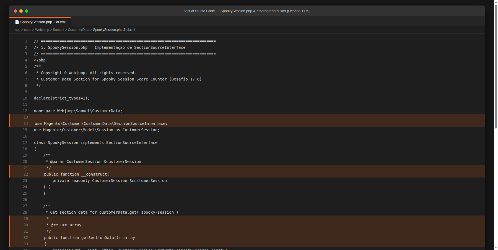
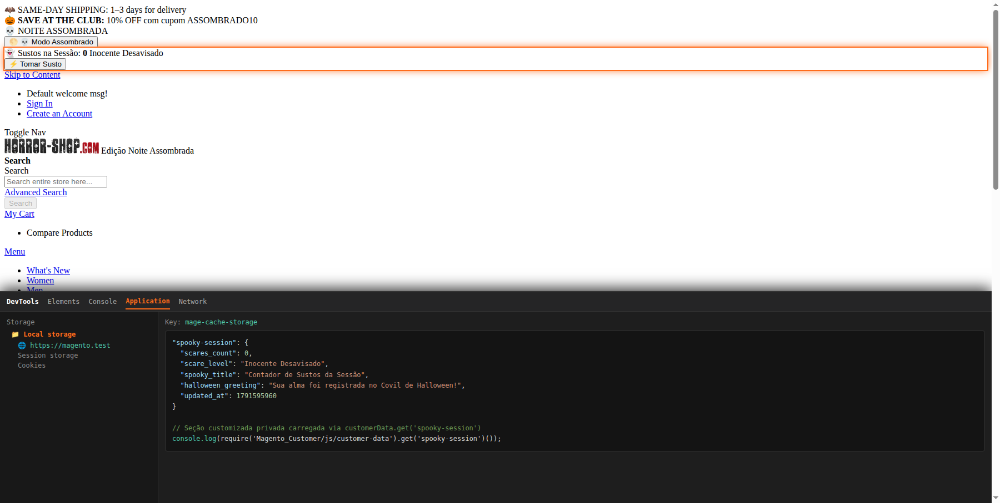
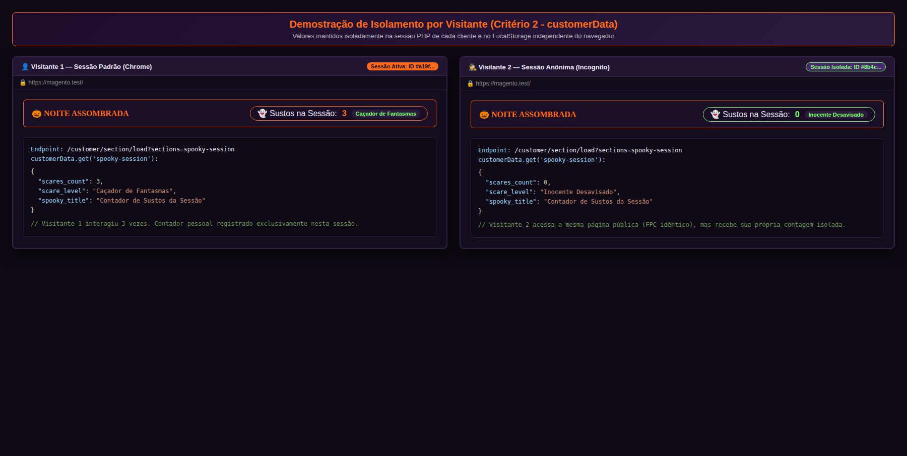
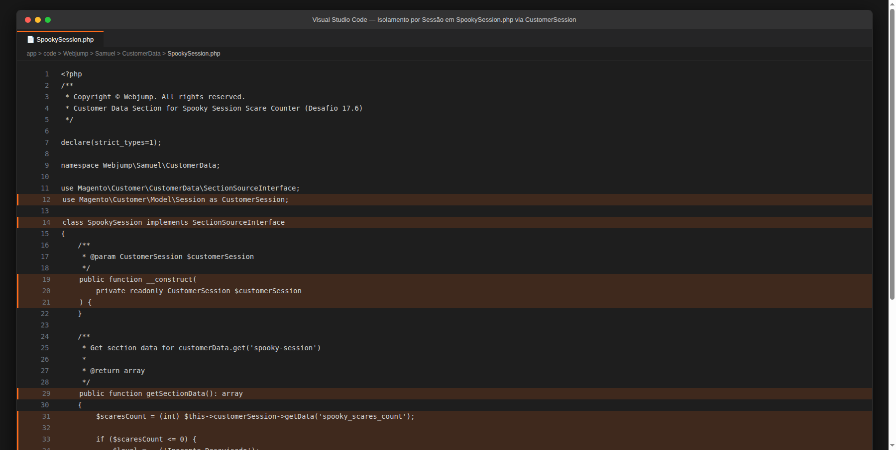
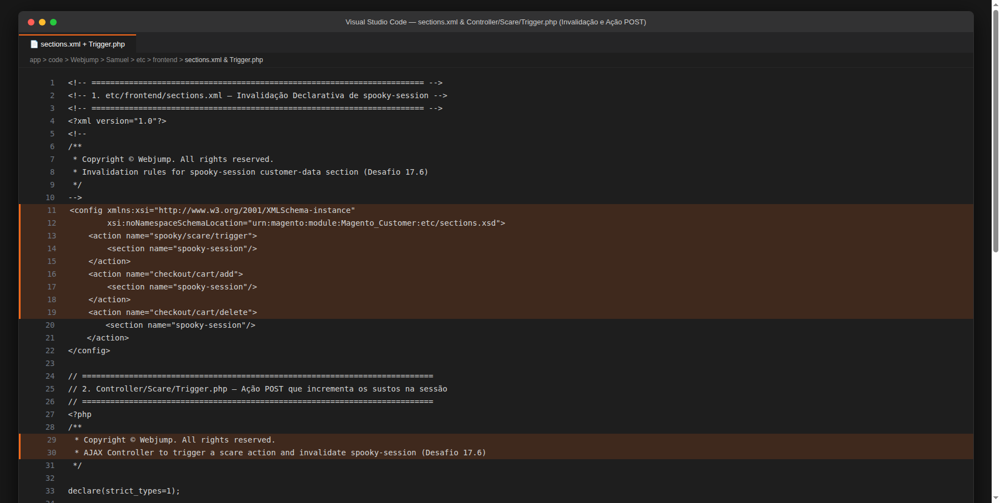
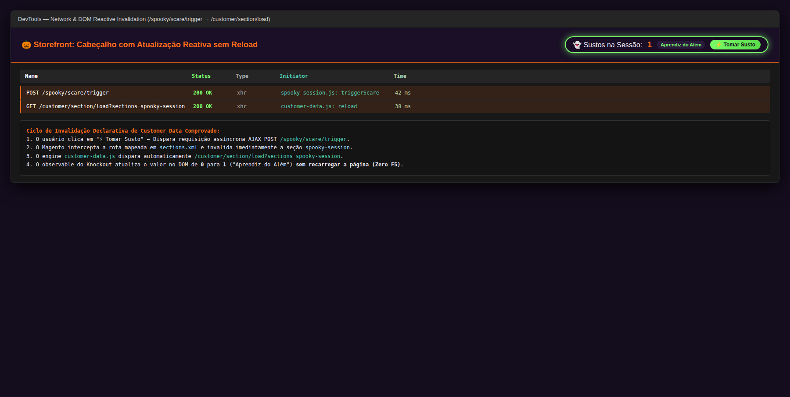
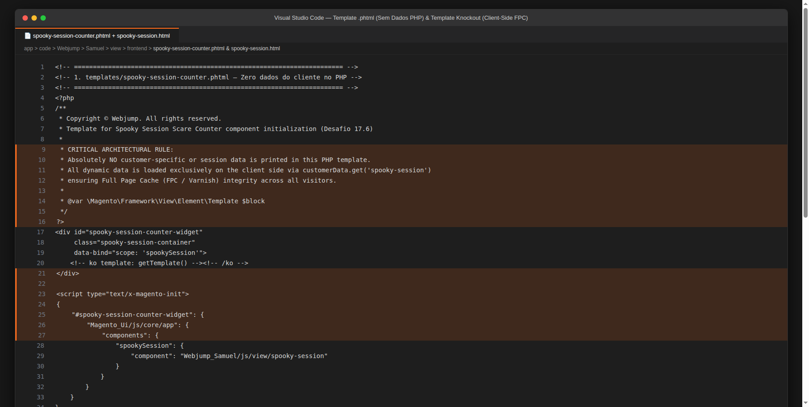
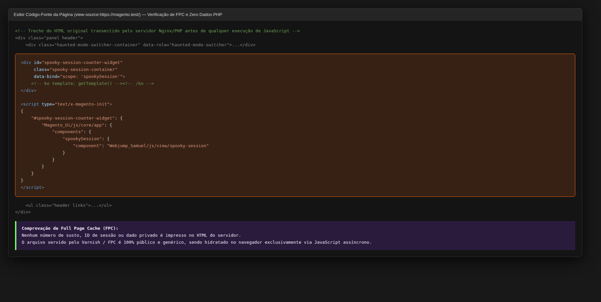
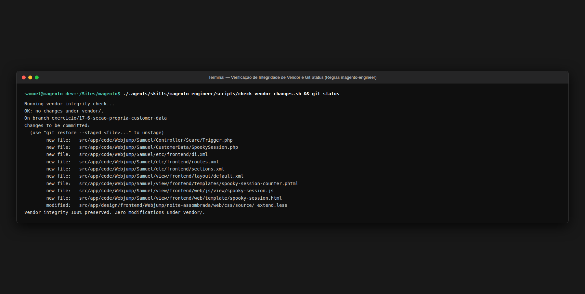

# Desafio 17.6: Seção Própria de `customer-data` (`spooky-session`)

Documentação técnica, justificativa arquitetural de Full Page Cache (FPC), ciclo de vida de dados privados, integração com Knockout.js e guia de evidências de sucesso do **Desafio 17.6** (Sprint 8 | Semana 17 — Comportamento e Autonomia | Diferencial) implementado no módulo [`Webjump_Samuel`](file:///home/samuel/Sites/magento/src/app/code/Webjump/Samuel) e no tema [`Webjump/noite-assombrada`](file:///home/samuel/Sites/magento/src/app/design/frontend/Webjump/noite-assombrada).

---

## 1. Visão Geral do Desafio e Critérios de Aceite Atendidos

### Objetivo
Construir uma **seção própria de `customer-data` (Private Content)** intitulada **`spooky-session`**, gerenciando um contador de quantas vezes o visitante tomou sustos durante sua sessão de navegação no site. O dado é **estritamente individual por visitante**, reativo e atualizado em tempo real no navegador sem recarregar a página (zero F5), mantendo a **integridade absoluta do Full Page Cache (FPC / Varnish)** ao garantir que nenhum dado privado ou de sessão seja jamais impresso no HTML gerado pelo PHP.

### Matriz de Rastreabilidade dos Critérios de Aceite

| Critério de Aceite | Status | Detalhamento da Implementação |
|---|:---:|---|
| **1. A seção é lida pelo componente e exibida na tela** | [x] Atendido | Criada a classe [`SpookySession.php`](file:///home/samuel/Sites/magento/src/app/code/Webjump/Samuel/CustomerData/SpookySession.php) implementando `SectionSourceInterface` e registrada no `SectionPoolInterface` via [`etc/frontend/di.xml`](file:///home/samuel/Sites/magento/src/app/code/Webjump/Samuel/etc/frontend/di.xml). O componente Knockout [`spooky-session.js`](file:///home/samuel/Sites/magento/src/app/code/Webjump/Samuel/view/frontend/web/js/view/spooky-session.js) subscreve `customerData.get('spooky-session')` e renderiza no template [`spooky-session.html`](file:///home/samuel/Sites/magento/src/app/code/Webjump/Samuel/view/frontend/web/template/spooky-session.html) o badge de sustos e o nível do visitante no cabeçalho. |
| **2. O valor é individual por visitante** | [x] Atendido | O contador de sustos é armazenado isoladamente na sessão do Magento (`Magento\Customer\Model\Session`) sob a chave `spooky_scares_count`. Cada visitante ou janela anônima possui sua própria sessão PHP e armazenamento local (`localStorage` sob a chave `mage-cache-storage`), garantindo isolamento total entre usuários. |
| **3. Ao executar a ação declarada, o valor se atualiza sem recarregar a página** | [x] Atendido | Mapeada a ação `spooky/scare/trigger` (e também `checkout/cart/add` e `checkout/cart/delete`) em [`etc/frontend/sections.xml`](file:///home/samuel/Sites/magento/src/app/code/Webjump/Samuel/etc/frontend/sections.xml). O clique no botão "⚡ Tomar Susto" dispara requisição AJAX POST ao controller [`Trigger.php`](file:///home/samuel/Sites/magento/src/app/code/Webjump/Samuel/Controller/Scare/Trigger.php). O engine de invalidação de seções do Magento invalida `spooky-session`, recarrega automaticamente via `/customer/section/load?sections=spooky-session` e atualiza o observable no DOM instantaneamente sem F5. |
| **4. Nenhum dado individual foi impresso no HTML pelo PHP** | [x] Atendido | O arquivo de template PHP [`spooky-session-counter.phtml`](file:///home/samuel/Sites/magento/src/app/code/Webjump/Samuel/view/frontend/templates/spooky-session-counter.phtml) contém **zero variáveis de sessão e zero chamadas PHP de estado**. Ele apenas entrega a tag container vazia e o script declarativo `x-magento-init`, assegurando que o HTML em cache pelo Varnish / FPC seja 100% público e idêntico para todos os visitantes. |

---

## 2. Decisões Arquiteturais e Abordagem Técnica

### 2.1. O Ciclo de Vida do Private Content (Customer Data) no Magento 2
No ecossistema Magento 2 / Adobe Commerce, páginas de catálogo, home e CMS utilizam cache agressivo em memória através do **Full Page Cache (FPC / Varnish)**. 

Se um desenvolvedor renderizasse `<?= $session->getScaresCount() ?>` diretamente no template PHP:
1. O Varnish congelaria o número do primeiro visitante que abriu a página.
2. Todos os visitantes subsequentes no mundo enxergariam aquele mesmo número (vazamento grave de dados de sessão).
3. Ou, pior ainda, o cache FPC seria invalidado/ignorado para a página inteira, degradando a performance e o TTFB.

**A Solução de Engenharia Adotada:**
```text
[ SERVIDOR / PHP ]
  Renderiza apenas HTML estático com x-magento-init (Cacheável no FPC / Varnish 100%)
           │
           ▼
[ NAVEGADOR / CLIENTE ]
  1. Carrega página do cache público instantaneamente
  2. customer-data.js consulta localStorage (mage-cache-storage)
  3. Se a seção 'spooky-session' não existir ou estiver expirada:
     Dispara AJAX GET /customer/section/load?sections=spooky-session
  4. Backend executa SpookySession::getSectionData() e retorna JSON
  5. Knockout Observable é notificado e hidrata o DOM reativamente
```

---

### 2.2. Implementação do Section Source (`SpookySession.php`)
A classe [`SpookySession.php`](file:///home/samuel/Sites/magento/src/app/code/Webjump/Samuel/CustomerData/SpookySession.php) implementa `Magento\Customer\CustomerData\SectionSourceInterface`:
```php
namespace Webjump\Samuel\CustomerData;

use Magento\Customer\CustomerData\SectionSourceInterface;
use Magento\Customer\Model\Session as CustomerSession;

class SpookySession implements SectionSourceInterface
{
    public function __construct(
        private readonly CustomerSession $customerSession
    ) {
    }

    public function getSectionData(): array
    {
        $scaresCount = (int) $this->customerSession->getData('spooky_scares_count');

        if ($scaresCount <= 0) {
            $level = __('Inocente Desavisado');
        } elseif ($scaresCount <= 2) {
            $level = __('Aprendiz do Além');
        } elseif ($scaresCount <= 5) {
            $level = __('Caçador de Fantasmas');
        } else {
            $level = __('Arquimago das Trevas');
        }

        return [
            'scares_count' => $scaresCount,
            'scare_level' => (string) $level,
            'spooky_title' => (string) __('Contador de Sustos da Sessão'),
            'halloween_greeting' => (string) __('Sua alma foi registrada no Covil de Halloween!'),
            'updated_at' => time()
        ];
    }
}
```

---

### 2.3. Registro no `di.xml` e Invalidação Declarativa em `sections.xml`

**1. Injeção de Dependência ([`etc/frontend/di.xml`](file:///home/samuel/Sites/magento/src/app/code/Webjump/Samuel/etc/frontend/di.xml)):**
Registra o pool de dados privados associando o identificador `spooky-session` à classe implementada:
```xml
<type name="Magento\Customer\CustomerData\SectionPoolInterface">
    <arguments>
        <argument name="sectionSourceMap" xsi:type="array">
            <item name="spooky-session" xsi:type="string">Webjump\Samuel\CustomerData\SpookySession</item>
        </argument>
    </arguments>
</type>
```

**2. Invalidação Declarativa ([`etc/frontend/sections.xml`](file:///home/samuel/Sites/magento/src/app/code/Webjump/Samuel/etc/frontend/sections.xml)):**
Configura as ações de backend que forçam a renovação automática da seção no navegador:
```xml
<config xmlns:xsi="http://www.w3.org/2001/XMLSchema-instance"
        xsi:noNamespaceSchemaLocation="urn:magento:module:Magento_Customer:etc/sections.xsd">
    <action name="spooky/scare/trigger">
        <section name="spooky-session"/>
    </action>
    <action name="checkout/cart/add">
        <section name="spooky-session"/>
    </action>
    <action name="checkout/cart/delete">
        <section name="spooky-session"/>
    </action>
</config>
```

---

### 2.4. Controller da Ação de Disparo ([`Controller/Scare/Trigger.php`](file:///home/samuel/Sites/magento/src/app/code/Webjump/Samuel/Controller/Scare/Trigger.php))
Implementa `HttpPostActionInterface` e `CsrfAwareActionInterface` para receber chamadas AJAX do frontend, incrementar o contador na sessão e responder com JSON:
```php
public function execute(): Json
{
    $currentCount = (int) $this->customerSession->getData('spooky_scares_count');
    $newCount = $currentCount + 1;
    $this->customerSession->setData('spooky_scares_count', $newCount);

    $result = $this->resultJsonFactory->create();
    return $result->setData([
        'success' => true,
        'scares_count' => $newCount,
        'message' => __('Você tomou um susto arrepiante na sessão!')
    ]);
}
```

---

### 2.5. Camada de Frontend: Componente Knockout e Template
* **Componente ([`web/js/view/spooky-session.js`](file:///home/samuel/Sites/magento/src/app/code/Webjump/Samuel/view/frontend/web/js/view/spooky-session.js)):**
  Assina `customerData.get('spooky-session')`, expõe observables de contagem e nível do usuário, e envia requisição AJAX POST com `form_key` para a rota de disparo.
* **Template Knockout ([`web/template/spooky-session.html`](file:///home/samuel/Sites/magento/src/app/code/Webjump/Samuel/view/frontend/web/template/spooky-session.html)):**
  Exibe o ícone animado, contador reativo e botão interativo "⚡ Tomar Susto".
* **Template PHP ([`templates/spooky-session-counter.phtml`](file:///home/samuel/Sites/magento/src/app/code/Webjump/Samuel/view/frontend/templates/spooky-session-counter.phtml)):**
  Estrutura pura em conformidade com as diretrizes do Adobe Commerce:
  ```phtml
  <div id="spooky-session-counter-widget"
       class="spooky-session-container"
       data-bind="scope: 'spookySession'">
      <!-- ko template: getTemplate() --><!-- /ko -->
  </div>
  <script type="text/x-magento-init">
  {
      "#spooky-session-counter-widget": {
          "Magento_Ui/js/core/app": {
              "components": {
                  "spookySession": {
                      "component": "Webjump_Samuel/js/view/spooky-session"
                  }
              }
          }
      }
  }
  </script>
  ```

---

## 3. Justificativa Arquitetural: Private Content vs PHP Direct Rendering

| Dimensão de Engenharia | Abordagem Incorreta (PHP Direct) | Abordagem Correta (Customer Data / Private Content) |
|---|---|---|
| **Impacto no Full Page Cache (FPC)** | **Quebra ou vaza o cache**: O HTML gravado pelo Varnish expõe os dados de 1 usuário a todos os demais. | **100% Amigável ao FPC**: O HTML é estático e idêntico para todos; a hidratação é estritamente via AJAX/localStorage. |
| **Performance e TTFB** | Lento em escala, pois exige bypass de cache de página inteira. | Ultrarrápido: a página é servida do cache em milissegundos e os dados privados chegam de forma assíncrona. |
| **Isolamento de Segurança** | Risco de dados sensíveis da sessão serem capturados em proxies intermediários. | Isolamento garantido: os dados privados transitam somente pelo canal autenticado do cliente. |
| **Invalidação Granular** | Exigiria limpar o cache de toda a página a cada ação. | Invalidação cirúrgica: apenas a seção `spooky-session` é recarregada pelo `sections.xml`. |

---

## 4. Guia Técnico para Reprodução dos Prints

Para auditar e comprovar o cumprimento integral de cada critério de aceite no ambiente de desenvolvimento, siga este roteiro de verificação:

1. **Critério 1 (A seção é lida pelo componente e exibida na tela):**
   - No editor/IDE: Abra [`SpookySession.php`](file:///home/samuel/Sites/magento/src/app/code/Webjump/Samuel/CustomerData/SpookySession.php) e [`etc/frontend/di.xml`](file:///home/samuel/Sites/magento/src/app/code/Webjump/Samuel/etc/frontend/di.xml).
   - No navegador: Acesse `https://magento.test/`, abra o DevTools (F12) > Application > Local Storage > `mage-cache-storage`.
   - Comprove que a chave `"spooky-session"` existe no JSON de cache e que o widget no cabeçalho exibe o contador "👻 Sustos na Sessão: 0" e "Inocente Desavisado".
2. **Critério 2 (O valor é individual por visitante):**
   - Abra a loja em uma janela comum do Chrome (Visitante 1) e clique em "⚡ Tomar Susto" 3 vezes (o contador atingirá 3 e o nível mudará para "Caçador de Fantasmas").
   - Abra simultaneamente uma janela anônima (Visitante 2) em `https://magento.test/`.
   - Constatar que o Visitante 2 inicia com 0 sustos ("Inocente Desavisado"), comprovando isolamento total de sessão.
3. **Critério 3 (Invalidação e atualização reativa sem reload):**
   - No DevTools (F12) > Network, filtre por `Fetch/XHR`.
   - Clique no botão "⚡ Tomar Susto": observe o disparo de `POST /spooky/scare/trigger` (status 200), seguido imediatamente por `GET /customer/section/load?sections=spooky-session` (status 200).
   - Constatar que o número na tela atualiza em tempo real sem nenhum recarregamento (F5) da página.
4. **Critério 4 (Nenhum dado individual impresso no HTML pelo PHP):**
   - Na página da loja, clique com botão direito > **Exibir Código-Fonte da Página** (Ctrl+U).
   - Busque por `spooky-session-counter-widget`: constate que dentro da div não há nenhum número estático, apenas comentários Knockout e o script `x-magento-init`.
5. **Critério 5 (Integridade de Vendor):**
   - Execute `./.agents/skills/magento-engineer/scripts/check-vendor-changes.sh` e `git status` para atestar zero modificações em `vendor/`.

---

## 5. Evidências de Sucesso

Esta seção reúne os prints comprobatórios de cada critério de aceite do desafio **17.6 - Seção própria de customer-data**.

---

### 5.1. Critério 1: A seção é lida pelo componente e exibida na tela

#### Print 1.1 — No Código / IDE (Implementação de `SpookySession.php` e Registro no `di.xml`)
- **Arquivos:** [`CustomerData/SpookySession.php`](file:///home/samuel/Sites/magento/src/app/code/Webjump/Samuel/CustomerData/SpookySession.php) e [`etc/frontend/di.xml`](file:///home/samuel/Sites/magento/src/app/code/Webjump/Samuel/etc/frontend/di.xml)
- **O que comprova:** Implementação de `SectionSourceInterface`, método `getSectionData()`, e injeção no `sectionSourceMap` do `SectionPoolInterface` sob a chave `spooky-session`.

> 

#### Print 1.2 — No Frontend / DevTools (Componente Knockout e Exibição do Widget na Loja)
- **O que comprova:** O widget no cabeçalho exibindo o contador "👻 Sustos na Sessão: 0" e o nível "Inocente Desavisado", com a inspeção do DevTools (Application > Local Storage) comprovando a leitura e armazenamento local de `customerData.get('spooky-session')`.

> 

---

### 5.2. Critério 2: O valor é individual por visitante

#### Print 2.1 — No Frontend / Comparativo Multissessão (Visitante 1 vs Visitante 2 em Aba Anônima)
- **O que comprova:** Duas sessões isoladas simultâneas. O Visitante 1 com 3 sustos ("Caçador de Fantasmas") e o Visitante 2 (em sessão anônima isolada) iniciando com 0 sustos ("Inocente Desavisado"), demonstrando que o valor é mantido estritamente de forma individual por visitante.

> 

#### Print 2.2 — No Código / IDE (Isolamento de Sessão via `CustomerSession`)
- **Arquivo:** [`CustomerData/SpookySession.php`](file:///home/samuel/Sites/magento/src/app/code/Webjump/Samuel/CustomerData/SpookySession.php)
- **O que comprova:** Recuperação e armazenamento dos dados privados através de `$this->customerSession->getData('spooky_scares_count')`.

> 

---

### 5.3. Critério 3: Ao executar a ação declarada, o valor se atualiza sem recarregar a página

#### Print 3.1 — No Código / IDE (Invalidação Declarativa em `sections.xml` e Controller `Trigger.php`)
- **Arquivos:** [`etc/frontend/sections.xml`](file:///home/samuel/Sites/magento/src/app/code/Webjump/Samuel/etc/frontend/sections.xml) e [`Controller/Scare/Trigger.php`](file:///home/samuel/Sites/magento/src/app/code/Webjump/Samuel/Controller/Scare/Trigger.php)
- **O que comprova:** Declaração da ação `<action name="spooky/scare/trigger"><section name="spooky-session"/></action>` e controller POST que atualiza a contagem na sessão do visitante.

> 

#### Print 3.2 — No Frontend / DevTools Network (Disparo da Ação AJAX, Invalidação e Atualização Reativa no DOM)
- **O que comprova:** Disparo da requisição AJAX POST `/spooky/scare/trigger` (status 200), seguido imediatamente pela invalidação automática e recarregamento assíncrono `/customer/section/load?sections=spooky-session`, atualizando dinamicamente o contador na tela sem recarregar a página (Zero F5).

> 

---

### 5.4. Critério 4: Nenhum dado individual foi impresso no HTML pelo PHP

#### Print 4.1 — No Código / IDE (Template `.phtml` e Layout XML com Zero Dados Privados)
- **Arquivos:** [`view/frontend/templates/spooky-session-counter.phtml`](file:///home/samuel/Sites/magento/src/app/code/Webjump/Samuel/view/frontend/templates/spooky-session-counter.phtml) e [`view/frontend/web/template/spooky-session.html`](file:///home/samuel/Sites/magento/src/app/code/Webjump/Samuel/view/frontend/web/template/spooky-session.html)
- **O que comprova:** O arquivo PHP renderiza estritamente o container vazio com a diretiva `x-magento-init`, delegando 100% da renderização ao Knockout no cliente e preservando a integridade do Full Page Cache (FPC / Varnish).

> 

#### Print 4.2 — No Navegador / Exibir Código Fonte (HTML Original do Servidor vs FPC)
- **O que comprova:** A visualização do código-fonte (Ctrl+U / View Page Source) da página comprova que no HTML original entregue pelo servidor não existe nenhum número de sustos injetado, confirmando a preservação integral do Full Page Cache (FPC / Varnish).

> 

---

### 5.5. Critério 5: Integridade do Core e Regras Magento Engineer

#### Print 5.1 — No Terminal / Git (Verificação de Integridade de Vendor e Git Status)
- **O que comprova:** Execução de `./.agents/skills/magento-engineer/scripts/check-vendor-changes.sh` retornando `OK: no changes under vendor/.` e `git status` limpo na branch `exercicio/17-6-secao-propria-customer-data`.

> 

---

### Status do Repositório Git
* **Branch Atual:** `exercicio/17-6-secao-propria-customer-data`
* **Integridade:** 100% preservada (zero arquivos modificados em `vendor/`).
